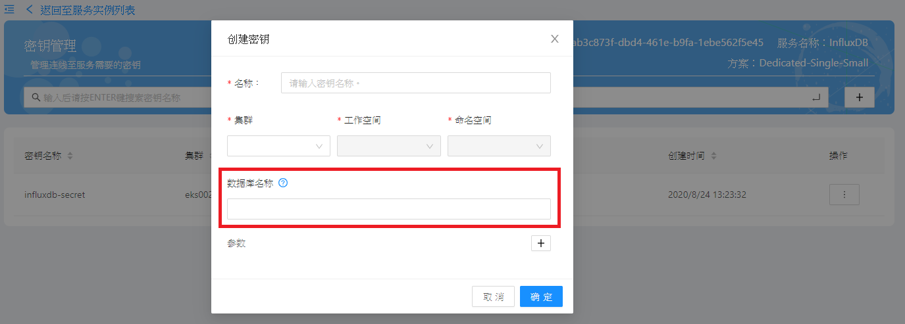

# 常见问题

* <a class="false-class" href="#一、創建密鑰或服務密鑰時，可以自行指定要使用的數據庫吗？">創建密鑰或服務密鑰時，可以自行指定要使用的數據庫吗？</a>
* <a class="false-class" href="#二、如何获取数据库的外部连接地址？">如何获取数据库的外部连接地址？</a>
* <a class="false-class" href="#三、可以在創建出的數據庫上套用Retention Policy嗎？">可以在創建出的數據庫上套用Retention Policy嗎？</a>
* <a class="false-class" href="#四、能夠将App的資料从原本的數據庫實例迁移到另一个數據庫實例嗎？">能夠将App的資料从原本的數據庫實例迁移到另一个數據庫實例嗎？</a>

### 一、創建密鑰或服務密鑰時，可以自行指定要使用的數據庫吗？

創建密鑰或服務密鑰時可以自行輸入數據庫名稱。 
但是數據庫名稱有使用字元以及字數上的限制，請點擊畫面上的「？」圖示取得更詳細的資訊。

### 二、如何获取数据库的外部连接地址？

外部连线信息可以从密鑰的證書中获取，其中的externalHosts即为外部连接地址。

### 三、可以在創建出的數據庫上套用Retention Policy嗎？

因為一些安全性的考量，我們暫時不提供此功能。

### 四、能夠将App的資料从原本的數據庫實例迁移到另一个數據庫實例嗎？

如果订购了多个數據庫实例，想将App的資料從原本的數據庫實例迁移到另一个數據庫實例，步骤如下：

1. 请先联系SRE迁移数据：WISE-PaaS.SRE@advantech.com.cn。

2. 登录Service Portal，将原本的數據庫實例下创建的密鑰删掉，删掉之前可以先查看證書內容，並记录下密鑰的名称和参数。 （WISE-PaaS平台提供的密鑰名称有特定规范，格式为：ServiceName-NamespaceName-secret，因此根据App名称可以找到其对应的密鑰）

   

3. 在新的數據庫實例中创建同名的密鑰，并指定相同的参数。

4. 重启App。
