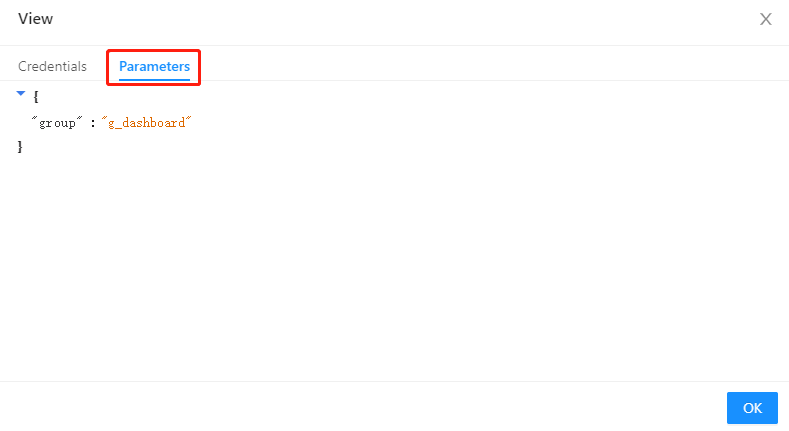

# 常见问题

**一、創建密鑰或服務密鑰時，可以自行指定要使用的數據庫吗？**

創建密鑰或服務密鑰時可以自行輸入數據庫名稱。 
但是數據庫名稱有使用字元以及字數上的限制，請點擊「？」圖示取得更詳細的資訊。

**二、如何获取数据库的外部连接地址？**

外部连线信息可以从密鑰的證書中获取，其中的externalHosts即为外部连接地址。

**三、如何获取数据库的外部连接地址？**

**四、如何将App的資料从原本的數據庫實例迁移到另一个數據庫實例呢？** 

用户如果订购了多个PostgreSQL实例，想将一个App从一个DB Instance1迁移到另一个DB Instance2，以Dashboard为例，步骤如下：

1. 如果需要迁移数据，请先联系SRE迁移数据：WISE-PaaS.SRE@advantech.com.cn；

2. 登录Service Portal，将DB Instance1中创建的dashboard Secret删掉（WISE-PaaS平台提供的App使用的Secret名称有一定规范，格式为：ServiceName-NamespaceName-secret，所以根据App名称可以找到其对应的Secret），删掉之前记录下Secret的名称和参数，参数从View Secret页面查看；

   

   

3. 在DB Instance2中创建同名的Secret，并指定相同的参数；

4. 重启App；
