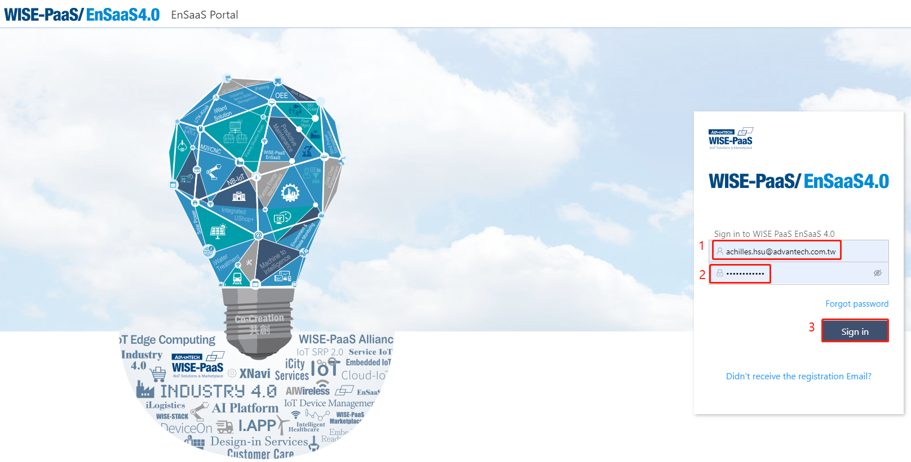
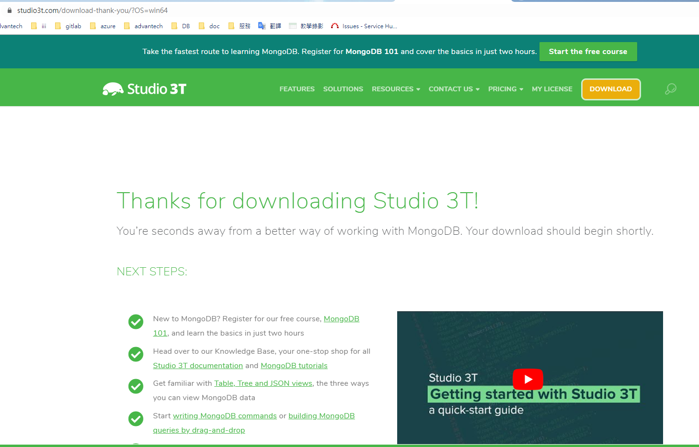
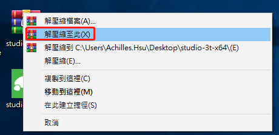
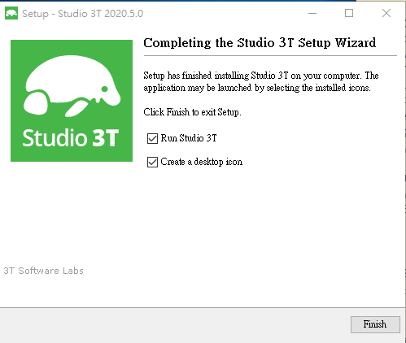
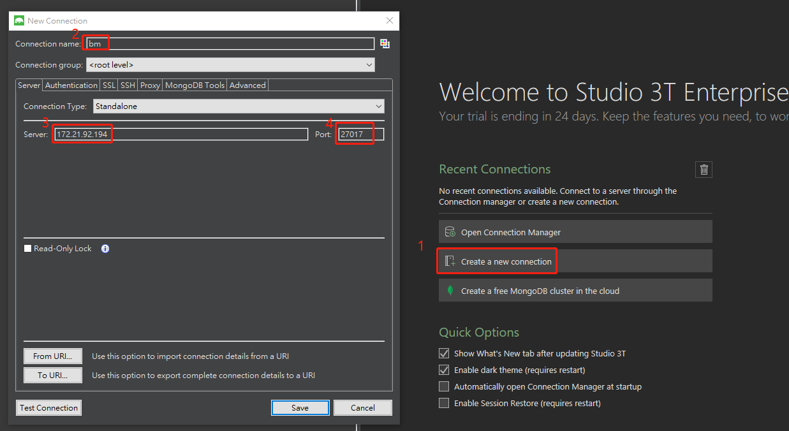
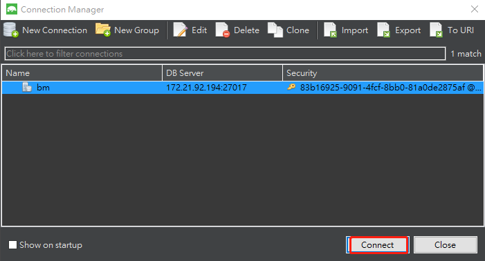
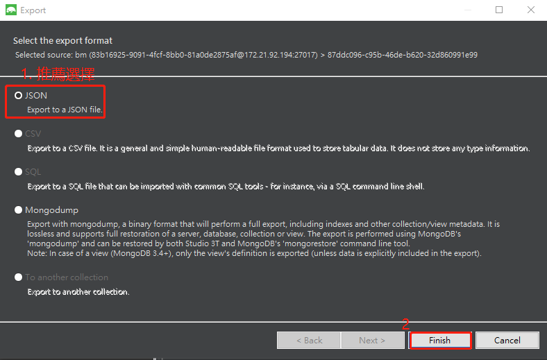
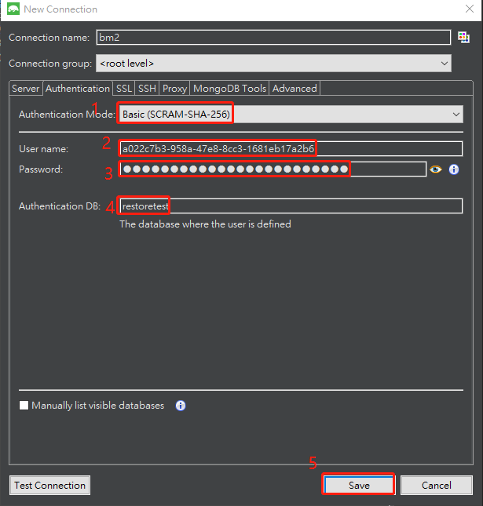
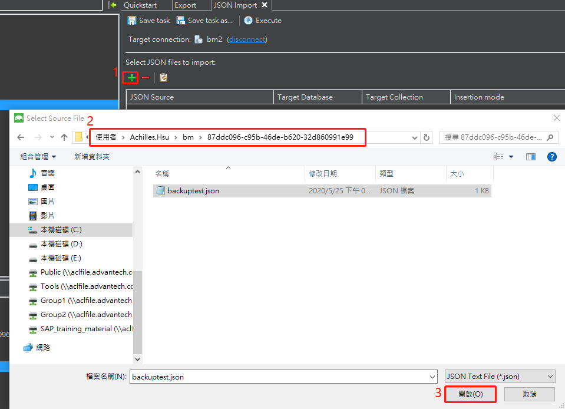

MongoDB 數據庫的備份還原SOP
==========================================

簡介
------------------------------------------
本文描述備份 mongodb 資料庫的優點、基本備份和還原詞彙，並詳細描述 ensaas 4.0 mongodb 單節點、多節點；windows 作業系統與 linux 作業系統的服務備份、還原的SOP流程。內容預設讀者已了解基本作業系統操作，EnSaaS 4.0 平台基礎知識，資料庫產品規格，以及資料庫的基本觀念和資料庫密鑰查看與使用

備份與還原元件提供基本的防護措施，可保護儲存於資料庫中所儲存的重要資料。若要將重大資料遺失的風險降至最低，您必須定期備份資料庫，以定期保存您對資料所做的修改。您可以在資料庫不繁忙的時間規劃持續的備份策略，有助於保護資料庫，防止各種失敗所導致的資料遺失。

定期備份優點
------------------------------------------
定期備份資料庫，並將備份的複本儲存在安全的異地位置，即可避免可能發生的重大資料遺失。**備份是保護資料的的唯一方法。**

使用有效的資料庫備份，就可以從多種失敗中復原資料，例如：
* 天然災害(策略：利用不同區域的儲存裝置儲存備份資料)
* 系統錯誤 (例如：斷電、網路問題或其他硬體或軟體導致資料庫服務中斷)
* 使用者操作錯誤(例如：不小心卸除資料表)
* 儲存媒體故障 (例如：磁碟機損壞或伺服器永久損毀)

此外，定期的資料庫備份的檔案，可以利用還原功能來進行搬遷任務。

名詞解釋
------------------------------------------
> EnSaaS 4.0 
>> 由 Cloud Foundary 轉換到 Kubernetes (K8s) 擁有更多彈性的研華科技雲平台。

> 備份[動詞]
>> 建立備份[名詞]的過程，就是從資料庫載下資料的紀錄。

> 備份[名詞]
>> 可用來還原資料的檔案，也可以用來將資料遷移到新位置

> MongoDB
>> 非結構化儲存(NOSQL)的資料庫

> Shared DB
>> EnSaaS 4.0 雲平台上販售的DB最小單位，disk限制10G，1000操作/每5分鐘，與其他用戶共享CPU和記憶體。

> Dedicated DB
>> SaaS 4.0 雲平台上販售的DB種類，擁有獨立的運算資源與記憶體。

> 作業系統
>> 當前操作備份動作的系統

> Secret 
>> 存放資料庫連線金鑰的位置

> 還原
>> 將指定備份檔案中的所有資料複製到指定資料庫中。

取得金鑰方式
-------------------------------------------------------------------------------
我們可以透過金鑰管理工具去取得自己的服務金鑰，請先登入屬於您的站點網頁

| 站點 | 金鑰管理位置 | 
| --- | --- |
| SA | https://portal-service-ensaas.sa.wise-paas.com/ |
| HZ | https://portal-service-ensaas.hz.wise-paas.com.cn/ |
| JE | https://portal-service-ensaas.jp.wise-paas.com/ |

取得金鑰操作步驟
1. 輸入您的使用者帳號密碼登入

2. 點選您的訂閱號(必須是該訂閱號的admin或是user才可以看得到)，選擇服務

3. 找到您購買的mongodb服務，點選 Secret Management

4. 找到您欲查詢的金鑰，點選 view

5. 即可看到金鑰詳細訊息


注意：在共享型資料庫(Shared DB)服務中，相同實例名稱的密鑰會使用相同的資料庫，但在專屬型資料庫(Dedicated DB)服務中，是可以自己分配不同的資料庫。 

使用Windows作業系統備份與還原SOP
-------------------------------------------------------------------------------
***Windows作業系統之備份SOP***

於windows中會使用到的工具為開源軟體 [mongo Studio 3T](https://studio3t.com/)
1. 請先至此[網頁](https://studio3t.com/download-thank-you/?OS=win64)進行下載

2. 點選存檔

3. 下載完成後，對壓縮檔點選右鍵，選擇解壓縮至此

4. 點選 studio-3t-x64.exe 安裝，允許APP變更您的裝置(選擇"是")

5. 點選 next --> next --> next --> finish

6. 點選 "crate a new connextion"，即可以輸入您的相關金鑰內容，Server地址和Port

7. 選擇Authentication分頁，Authentication Mode選擇 Basic (SCRAM-SHA-256)，輸入您的相關金鑰內容User name、Passwrod 和 Authentication DB位置，點選save

8. 點選Connect

9. 選擇想要進行備份動作的 Database，右鍵 Export Collections...

10. 推薦選擇 JSON，點選Finish

11. 點選執行，可以於左邊選單欄位Export Overview查看檔案存放位置和詳細細節

12. 備份完成


***Windows作業系統之還原SOP***
1. 於桌面選單執行 Studio 3T

2. 點選 "crate a new connextion"，即可以輸入您的相關金鑰內容，Server地址和Port

3. 選擇Authentication分頁，Authentication Mode選擇 Basic (SCRAM-SHA-256)，輸入您的相關金鑰內容User name、Passwrod 和 Authentication DB位置，點選save

4. 點選您的新服務名稱，點選Connect

5. 選擇想要進行還原動作的 Database，右鍵 Import Collections...

6. 選擇您欲還原的檔案，本範例使用的是JSON - mongo shell / Studio 3T / mongoexport

7. 選擇備份步驟11顯示的檔案存放資料夾，點選選擇資料夾內的 [collection].json

8. 點選上方 Execute，可以查看左下方執行結果，並且檢查新的collection內容是否有誤

9. 還原完成


使用Linux作業系統備份與還原SOP
-------------------------------------------------------------------------------

***Linux作業系統之備份SOP***
本篇文章中使用到 ubuntu 18.04 和 mongodb (開源程式) 工具進行備份動作

1. 透過指令安裝mongodb-client
```
sudo apt-key adv --keyserver hkp://keyserver.ubuntu.com:80 --recv 4B7C549A058F8B6B
echo "deb [ arch=amd64 ] https://repo.mongodb.org/apt/ubuntu bionic/mongodb-org/4.2 multiverse" | sudo tee /etc/apt/sources.list.d/mongodb.list
sudo apt update
sudo apt install mongodb-clients
```
2. 確認安裝完成
```
mongodump --version
```
3. 備份資料庫，使用以下指令，請將需要備份的資料庫金鑰內容替換。
```
mongodump --forceTableScan --host $old_ip --port $old_port --username $old_root --password $old_root_password --db $old_database --authenticationDatabase $old_authdb --out ./backup
```
4. 備份完成

***Linux作業系統之還原SOP***

1. 還原資料庫，使用以下指令，請將需要備份的資料庫金鑰內容替換
```
mongorestore --host $new_ip --port $new_port --username $new_root --password $new_root_password --db $new_database --authenticationDatabase $new_authdb ./backup/$old_database
```
2. 使用指令連進去mongodb裡
```
mongo --host $new_ip --port $new_port --username $new_root --password $new_root_password --authenticationDatabase $new_authdb
use $new_authdb
show collections
```
3. 還原成功
