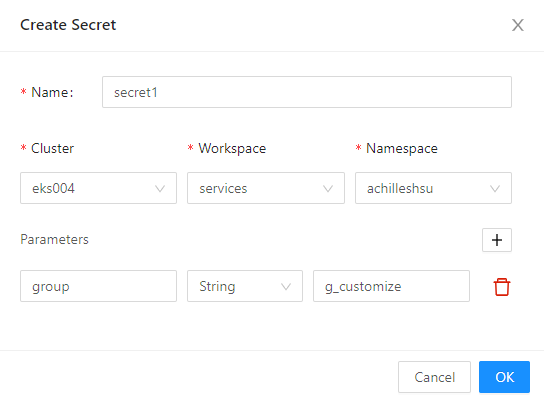

# Group管理机制

本文主要介绍PostgreSQL数据库里的Group管理机制，您可以通过Group管理机制来管理App访问PostgreSQL的权限，隔离用户权限，实现多租户管理。

## 问题引入

在EnSaaS平台使用PostgreSQL服务的时候，可能会遇到以下问题：

1. 如果多个App共用一个Shared DB，如何隔离用户的权限，保证App的数据不被其他App访问到？
2. 在EnSaaS平台，App如果要连接PostgreSQL数据库，首先要创建一个Secret，创建Secret会创建一组账密，然后可以从Secret中获取DB的连接信息和账密，App首次连接DB，肯定会创建Schema和Table，如果Secret被删除，重新创建新的Secret（会产生新的用户名和密码），如何保证新的Secret中的用户也有访问Schema和Table的权限？

下面带着这些问题，来寻找解决方案，先来看一下EnSaaS平台的PostgreSQL服务都定义了哪些Group类型。

## Group类型

在EnSaaS平台，App如果要连接PostgreSQL数据库，首先要创建一个Secret，详细方法可以参考《快速入门》。

EnSaaS平台提供的PostgreSQL服务加入了group的概念，依照创建Secret时带入的group参数，Secret中的用户可能存在不同的group中，并具有此group的权限：

- **DatabaseName**：默认group，此group与database名称同名，创建Secret时没有带入任何参数，Secret中的用户默认会被加入到此group中。

- **g_ro_public** ：默认group，创建Secret时没有带入任何参数，Secret中的用户默认会被加入到此group中。在此group的使用者，对于public schema有read only的权限。

- **g_rw_public** ：在此group的使用者，对于public schema具有read/write的权限，所以如果需要public schema的读写权限，在创建Secret的时候，需要添加group参数，如下 ：

  

- **Customize**：使用者自行定义group名称，并在创建Secret的时候填入group参数，这样Secret中的用户就会加入到自定义的group中，而其他用户没有此group的权限，便可以实现权限隔离，例如定义一个名为g_customize的group，在创建Secret的时候，填写参数如下：

  

## App授权Schema和Table

了解group类型后，您可以知道，创建Secret后，可以创建一个属于某个或某些group的用户，假如这个用户为user1，那么我们再来看上面的问题，App首次连接DB后，会用user1去创建schema和table，schema和table的owner默认为user1，即只有user1才有访问schema和table的权限，如果Secret1被删除，重新创建一个Secret2，就会创建一个新的用户user2，那么App再用user2去访问user1创建的schema和table时，就会出现没有权限访问的错误，那么这个问题应该如何解决呢？

1. 定义一个group，每次创建Secret的时候，都带入group参数，这样每次创建出来的user都属于相同的group；
2. app 建立自己拥有的schema或table后，将owner指定给group，即让此group的用户都具有访问schema和table的权限，其语法如下:

```
CREATE SCHEMA IF NOT EXISTS "testSchema";
ALTER SCHEMA "testSchema" OWNER TO "<groupName>";
CREATE TABLE IF NOT EXISTS testSchema.testTable;
ALTER TABLE testSchema.testTable OWNER to "<groupName>";
GRANT ALL ON ALL TABLES IN SCHEMA "testSchema" TO "<groupName>";
GRANT ALL ON ALL SEQUENCES IN SCHEMA "testSchema" TO "<groupName>"; 
```

## 多个App共用资料

如果多个App要共用资料，只需让多个App使用相同的group，即在创建Secret的时候带入相同的group参数，并且让App将需要访问的资料授权给此group即可。
