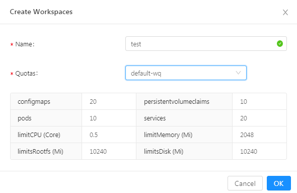
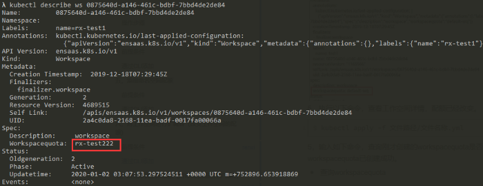

# 获取集群config文件
1，打开浏览器，在地址栏中输入Managent portal的网络地址，按“Enter”。

2，输入输入“用户名”、“密码”，单击登录。

3，根据用户角色，参考下面的步骤获取config文件。

## 用户角色是cluster owner及以上：
1，点击界面左上角的菜单按钮，点击Platform Management->Dedicate Cluster->Clusters或Platform Management->Shared Cluster->Clusters。进入Cluster管理页面。

2，在需要获取config的集群右侧点击Operation栏位，点击config按钮。config文件即下载到本地。

## 用户角色是workspace owner：
1，点击界面左上角的菜单按钮，点击Platform Management->Dedicate Cluster->Workspaces或Platform Management->Shared Cluster->General Workspaces。进入workspace管理页面。

2，切换cluster，找到需要获取config文件的workspace。

3，在需要获取config的workspace右侧点击Operation栏位，点击config按钮。config文件即下载到本地。

## 用户角色是namespace developer：
 1，点击界面左上角的菜单按钮，点击Platform Management->Dedicate Cluster->Namespaces或Platform Management->Shared Cluster->Namespaces。进入namespace管理页面。

2，切换cluster，和workspace，找到需要获取config文件的namespace。

3，在需要获取config的namespace右侧点击Operation栏位，点击config按钮。config文件即下载到本地。

**说明：**

 1，同一个用户同一个集群的config文件是相同的。即对于某个用户，同一个集群，在某个namespace，workspace或cluster右侧点击config下载的config都是相同的，只要他们属于同一个集群。

2，具体选择Dedicate Cluster还是Shared Cluster取决于购买的产品。根据需要选择对应的菜单下载config。

​	如果购买的产品是Dedicate Cluster则在Dedicate Cluster菜单下。

​	如果购买的是General Workspace，则在Shared Cluster菜单下。

# 添加工作空间
## 前提条件
1，添加工作空间，用户需要具备cluster owner及以上角色或者是订阅号的admin角色，其他角色没有权限添加。

2，用户需要购买了Dedicate Cluster，才可以在Dedicate cluster下添加工作空间。

## 通过Managent Portal界面添加
1，打开浏览器，在地址栏中输入Managent Portal的网络地址，按“Enter”。

2，输入输入“用户名”、“密码”，单击登录。

3，点击界面左上角的菜单按钮，点击Platform Management->Dedicate Cluster->Workspace。进入Workspace管理页面。


4，在cluster下拉框处选择集群（workspace将创建在该集群下），点击创建按钮+，进入创建workspace的页面。

5，输入workspace的名称，选择workspace的Quota，点击OK按钮。



6，成功创建workspace后，可以在workspace页面下方的列表看见新创建的workspace。

## 通过CLI添加
### 前提条件
1，用户已获取集群的config文件。如未获取，请参考一，获取集群config文件小节进行获取。

2，用户本地有安装kubectl。

### 操作步骤
1，将config文件（如果文件名称不为config，需要更名为config，不带文件后缀）放入C:\Users\\{用户名}\\\.kube文件夹下。


2，新建一个文件，后缀以.yml结尾。

3，编辑步骤3中新建的文件，符合如下格式的配置。

```
apiVersion: ensaas.k8s.io/v1
kind: Workspace
metadata:
  name: 0875640d-a146-461c-bdbf-7bbd4de2de84
  labels:
    name: rxtest1
spec:
  description: 'workspace'
  workspacequota: test-wq
```
其中：
* metadata中的name必须符合guid的格式。需要用户填入，可以通过[在线工具](http://www.uuid.online/)生成。
* metadata->label中的name为UI上展示的workspace名称。label的命名规范：支持英文大小写以及数字，长度小于8。
* metadata->name如果与集群中已存在的workspace的metadata->name相同，则表示对已存在的workspace进行编辑。
* spec->workspacequota表示workspace的配额。如果需要查看有哪些workspacequota以及workspacequota的详情，请参考步骤4.

4，查询和查看workspacequota：

* 查询workspacequota
```
  $ kubectl get workspacequota
  NAME         AGE
  test-wq   5d6h
```
* 查看某个workspacequtoa详情
```
  $ kubectl describe  workspacequota default-wq
```
5，打开命令行。输入如下命令：
```
$ kubectl apply -f 文件路径/文件名称.yml
```
6，输入如下命令，查询workspace列表以及workspace详细信息。
检查刚才创建的workspace是否在列表中（此处NAME为配置中的metadata->name）。如果存在，表示workspace已创建成功。

```
$ kubectl get workspace
NAME                                   AGE
0875640d-a146-461c-bdbf-7bbd4de2de84   15m
336c7021-94ed-47bf-a624-f353ce2606d7   26h
$ kubectl describe workspace 0875640d-a146-461c-bdbf-7bbd4de2de84
```
# 添加命名空间
## 前提条件
添加命名空间，用户需要具备workspace owner及以上角色或者是订阅号的admin角色，其他角色没有权限添加。

## 通过Managent Portal界面添加
1，打开浏览器，在地址栏中输入Managent Portal的网络地址，按“Enter”。

2，输入输入“用户名”、“密码”，单击登录。

3，点击界面左上角的菜单按钮，点击Platform Management->Dedicate Cluster->Namespaces或Platform Management->Shared Cluster->Namespaces。进入Namespace管理页面。

4，选择期望的cluster和workspace（新建的namespace将创建在该workspace下）。点击创建按钮+，进入创建namespace的页面。


5，在Name输入框输入namespace的名称，选择namespace的Quota，点击OK按钮。


6，成功创建namespace后，可以在namespace页面下方的列表看见新创建的namespace。

## 通过CLI添加
### 前提条件
1，用户已获取集群的config文件。如未获取，请参考[一，获取集群config文件小节]进行获取。

2，用户本地有安装kubectl。

### 操作步骤
1，将config文件（如果文件名称不为config，需要更名为config，不带文件后缀）放入C:\Users\\{用户名}\.kube文件夹下。

2，新建一个文件，后缀以.yml结尾。

3，编辑步骤2中新建的文件，符合如下格式的配置。

```
apiVersion: v1
kind: Namespace
metadata:
  name: test
  labels:
    workspace: 0875640d-a146-461c-bdbf-7bbd4de2de84
    namespacequota: nsquota-1000m1core
```
其中：
* metadata中的name为namespace的名称。命名规范：Only a-z, 0-9 allowe，长度小于16。
* metadata->labels->workspace表示创建的namespace所属的workspace。如果需要查看有哪些workspace以及workspace的详情，请参考步骤4.
* metadata->labels->namespacequota表示namepace的配额。非必填，如果不填写，表示配额不做限制。如果需要查看有哪些namespacequota以及namespacequota的详情，请参考步骤5.

4，查询workspace name和详情:

* 查询workspace列表，metadata->labels->workspace填入此处的NAME值
```
  $ kubectl get workspace
  NAME                                   AGE
  0875640d-a146-461c-bdbf-7bbd4de2de84   20h
  336c7021-94ed-47bf-a624-f353ce2606d7   45h
```
* 查询workspace的信息。查看信息中的Labels，Labels中的name为Management Portal页面上显示的workspace的名称
```
  $ kubectl describe workspace 0875640d-a146-461c-bdbf-7bbd4de2d
  Name:         0875640d-a146-461c-bdbf-7bbd4de2de84
  Namespace:
  Labels:       name=rx-test1
  .....
```
5，查询和查看namepacequota：
* 查询namespacequota列表
```
  $ kubectl get namespacequota
```
* 查看某个namespacequtoa详情
```
  $ kubectl describe namespacequota {quotaName}                                               
```
6，输入如下命令：
```
$ kubectl apply -f 文件路径/文件名称.yml
```
7，输入如下命令，查询刚才创建的namespace是否在列表中（此处NAME为配置中的metadata->name）。如果存在，表示namespace已创建成功。
```
$ kubectl get namespace
```
# 添加工作空间配额
## 前提条件
添加工作空间配额，用户需要具备cluster owner及以上角色，其他角色没有权限添加。

## 通过Managent Portal界面添加

1，打开浏览器，在地址栏中输入Managent Portal的网络地址，按“Enter”。

2，输入输入“用户名”、“密码”，单击登录。

3，点击界面左上角的菜单按钮，点击Infrastructure->Quotas。进入Quotas管理页面。

4，点击左侧菜单Workspace Quotas，进入Workspace Quotas管理页面。

5，选择期望的cluster（新建的workspace quota将创建在该cluster下）, 点击页面上的添加按钮+，进入创建workspace quota对话框。

6，填写Name和quota信息，点击OK按钮，即完成workspace quota创建。

7，成功创建workspace quota后，可以在Workspace Quotas页面的列表看见新创建的workspace quota。

## 通过CLI添加

1，将config文件（如果文件名称不为config，需要更名为config，不带文件后缀）放入C:\Users{用户名}\.kube文件夹下。

2，新建一个文件，后缀以.yml结尾。

3，编辑步骤2中新建的文件，符合如下格式的配置。

```
apiVersion: ensaas.k8s.io/v1
kind: WorkspaceQuota
metadata:
  name: wsquota-test
spec:
  quotas:
    limits.cpu: "5"
    limits.memory: "100"
    pods: "5"
    requests.storage: "100"
    persistentvolumeclaims: "1"
    limits.ephemeral-storage: "100"
    services: "5"
    secrets: "5"
    configmaps: "5"
```
其中：
* metadata->name是workspace qutoa的名称。命名规则：Only a-z, 0-9 . and - allowed
* metadata->spec->quotas为实际填写的配额值。
* metadata->spec->quotas目前支持配置9项。但不是所有9项都是必填，最少填写一项即可。如果某些项不填写，表示该项配额为unlimited。
  * metadata->spec->quotas->limits.cpu：与k8s上的limit.cpu相对应。单位为core。
  * metadata->spec->quotas->limits.memory：与k8s上的limit.memory相对应。单位为M。
  * metadata->spec->quotas->pods：表示workspace最多可以存在的pod个数。
  * metadata->spec->quotas->requests.storage：表示workspace最多可以存在的PVC disk的大小，单位为M。
  * metadata->spec->quotas->persistentvolumeclaims：表示workspace最多可以存在的PVC个数。
  * metadata->spec->quotas->limits.ephemeral-storage：表示workspace最多可以使用的临时存储的大小，单位为M。
  * metadata->spec->quotas->services：表示workspace最多可以存在的service个数。
  * metadata->spec->quotas->configmaps：表示workspace最多可以存在的configmap个数。
* 目前不支持对已存在的配额进行编辑。

4，打开命令行。输入如下命令：

```
$ kubectl apply -f 文件路径/文件名称.yml
```
5，输入如下命令，查询刚才创建的workspacequota是否在列表中。如果存在，表示workspacequota已创建成功。
* 查询workspacequota
```
  $ kubectl get workspacequota
  NAME         AGE
  test-wq   5d6h
```
* 查看某个workspacequtoa详情
```
  $ kubectl describe  workspacequota default-wq
```
# 添加命名空间配额
## 前提条件
添加命名空间配额，用户需要具备workspace owner及以上角色，其他角色没有权限添加。

## 通过Managent Portal界面添加

1，打开浏览器，在地址栏中输入Managent Portal的网络地址，按“Enter”。

2，输入输入“用户名”、“密码”，单击登录。

3，点击界面左上角的菜单按钮，点击Infrastructure->Quotas。进入Quotas管理页面。

4，点击左侧菜单Namespace Quotas，进入Namespace Quotas管理页面。

5，选择期望的cluster和workspace（新建的namespace quota将创建在该workspace下）, 点击页面上的添加按钮+，进入创建namespace quota对话框。

6，填写Name和quota信息，点击OK按钮，即完成namespace quota创建。

7，成功创建namespace quota后，可以在Namespace Quotas页面下方的列表看见新创建的namespace quota。

## **通过CLI添加**
1，将config文件（如果文件名称不为config，需要更名为config，不带文件后缀）放入C:\Users{用户名}\.kube文件夹下。

2，新建一个文件，后缀以.yml结尾。

3，编辑步骤2中新建的文件，符合如下格式的配置。

```
apiVersion: ensaas.k8s.io/v1
kind: NamespaceQuota
metadata:
  name: nsquota-1000m1core
  labels:
    workspace: 0875640d-a146-461c-bdbf-7bbd4de2de84
spec:
  description: "namespace quota"
  quotas:
    limits.cpu: "5"
    limits.memory: "1000"
    pods: "5"
    services: "5"
    configmaps: "5"
    requests.storage: "100"
    persistentvolumeclaims: "5"
    limits.ephemeral-storage: "1000"
    secrets: "5"
```
其中：
* metadata->name是namespace qutoa的名称。命名规则：Only a-z, 0-9 . and - allowed
* metadata->labels->workspace表示创建的namespacequota所属的workspace。此处必须填写。如果需要查看有哪些workspace以及workspace的详情，请参考二，添加工作空间->通过CLI添加->步骤6。
* metadata->spec->quotas为实际填写的配额值。
* metadata->spec->quotas目前支持配置9项。但不是所有9项都是必填，最少填写一项即可。如果某些项不填写，表示该项配额为unlimited。
  * metadata->spec->quotas->limits.cpu：与k8s上的limit.cpu相对应。单位为core。
  * metadata->spec->quotas->limits.memory：与k8s上的limit.memory相对应。单位为M。
  * metadata->spec->quotas->pods：表示workspace最多可以存在的pod个数。
  * metadata->spec->quotas->requests.storage：表示namespace最多可以存在的PVC disk的大小，单位为M。
  * metadata->spec->quotas->persistentvolumeclaims：表示namespace最多可以存在的PVC个数。
  * metadata->spec->quotas->limits.ephemeral-storage：表示namespace最多可以使用的临时存储的大小，单位为M。
  * metadata->spec->quotas->services：表示namespace最多可以存在的service个数。
  * metadata->spec->quotas->configmaps：表示namespace最多可以存在的configmap个数。
* 目前不支持对已存在的配额进行编辑。

4，打开命令行。输入如下命令：

```
$ kubectl apply -f 文件路径/文件名称.yml
```
5，输入如下命令，查询刚才创建的namespacequota是否在列表中。如果存在，表示namespacequota已创建成功。
* 查询namespacequota
```
  $ kubectl get namespacespacequota
  NAME         AGE
  test-nq   5d6h
```
* 查看某个namespacequtoa详情
```
  $ kubectl describe  namespacequota default-nq
```
# 对工作空间进行扩减容（改变工作空间的配额）
## 前提条件
1，对工作空间进行扩减容（改变工作空间配额），用户需要具备cluster owner及以上角色或是订阅号admin，其他角色没有权限。

2，只有购买了Dedicate Cluster，才可以对Cluster下的工作空间进行扩减容。

## 通过Managent Portal界面

1，打开浏览器，在地址栏中输入Managent Portal的网络地址，按“Enter”。

2，输入输入“用户名”、“密码”，单击登录。

3，点击界面左上角的菜单按钮，点击Platform Management->Dedicate Cluster->Workspaces。进入Workspace管理页面。

4，在workspace列表中，找到需要变更配额的workspace，在右侧Operation栏位点击，选择Scale，进入变更配额页面。

5，在变更配额页面可以看见配额列表以及当前绑定的配额，点击每个配额名称旁边的按钮可以展开配额查看配额详情。

6，在期望的配额右侧Operation栏位点击bind按钮，会弹出确认变更配额对话框，点击确定，完成配额变更。

7，配额变更成功后，在页面上方可以看见Current Quota发生变化。同时被绑定配额Operation栏位是蓝色高亮状态。

8，点击页面上方的Current Workspace处的workspace名称，返回workspace列表。查看workspace列表显示的配额已变成期望的配额。

## **通过CLI执行**
1，将config文件（如果文件名称不为config，需要更名为config，不带文件后缀）放入C:\Users{用户名}\.kube文件夹下。

2，执行以下命名，找到需要扩/减容的工作空间。其中，name为创建工作空间时，metadata->label中的name，UI上显示的也是这个名称。

```
$ kubectl get ws -l name=test1
NAME                                   AGE
0875640d-a146-461c-bdbf-7bbd4de2de84   14d
```
3，执行以下命名，找到及查看需要设置的配额名称。
```
$ kubectl get wq
$ kubectl describe wq {workspacequotaName}
```
4，执行以下命令，对工作空间进行编辑。
```
$ kubectl edit ws 0875640d-a146-461c-bdbf-7bbd4de2de84
```
5，改变spec->workspacequota字段，设置为需要给工作空间配置的配额名称（当quota名称为数字时，需要加上双引号，例如："111"）。按CTRL+S保存。

6，执行以下命令，查看工作空间详情，配额已经改变。

```
$ kubectl describe ws 0875640d-a146-461c-bdbf-7bbd4de2de84
```


# 对命名空间进行扩减容（改变命名空间的配额）
## 前提条件
对命名空间进行扩减容（改变命名空间配额），用户需要具备workspace owner及以上角色，其他角色没有权限。

## 通过Managent Portal界面

1，打开浏览器，在地址栏中输入Managent Portal的网络地址，按“Enter”。

2，输入输入“用户名”、“密码”，单击登录。

3，点击界面左上角的菜单按钮，点击Platform Management->Dedicate Cluster->Namespaces或Platform Management->Shared Cluster->Namespaces。进入Namespace管理页面。

4，在Namespace列表中，找到需要变更配额的Namespace，在右侧Operation栏位点击，选择Scale，进入变更配额页面。

5，在变更配额页面可以看见配额列表以及当前绑定的配额，点击每个配额名称旁边的按钮可以展开配额查看配额详情。

6，在期望的配额右侧Operation栏位点击bind按钮，会弹出确认变更配额对话框，点击确定，完成配额变更。

7，配额变更成功后，在页面上方可以看见Current Quota发生变化。同时被绑定配额Operation栏位是蓝色高亮状态。

8，点击页面上方的Current Namespace处的Namespace名称，返回Namespace列表。查看Namespace列表显示的配额已变成期望的配额。

## **通过CLI执行**
1，将config文件（如果文件名称不为config，需要更名为config，不带文件后缀）放入C:\Users{用户名}\.kube文件夹下。

2，执行以下命名，找到需要扩/减容的命名空间，并查看命名空间详情，可以看到当前的配额名称。

* 查看命名空间列表，其中workspace表示ns所属的wrokspace
```
$ kubectl get ns -l workspace=0875640d-a146-461c-bdbf-7bbd4de2de84
```
* 查看命名空间详情，其中Labels->namespacequota记录的为命名空间的配额。如果为空，表示没有设置配额。
```
$ kubectl describe ns {namespaceName}
```
3，执行以下命名，找到及查看需要设置的配额名称，其中workspace为namespace所属的workspace。
```
$ kubectl get nq -l workspace=0875640d-a146-461c-bdbf-7bbd4de2de84
$ kubectl describe nq {namespacequotaName}
```
**注意**：namespace和这个namespace的配额只属于同一个workspace。即namespace在workspace A下面。那么这个namespace所设置的配额也必须在workspace A下面。
所以，查找配额时，建议加上-l workspace 参数。

4，执行以下命令，对工作空间进行编辑。

```
$ kubectl edit ns {namespaceName}
```
5，改变metadata->labels->namespacequota字段，设置为需要给命名空间配置的配额名称（当quota名称为数字时，需要加上双引号，例如："111"）。按CTRL+S保存。

6，执行以下命令，查看命名空间详情，配额已经改变。

```
$ kubectl describe ns {namespaceName}
```


# 查看工作空间配额

## 前提条件

查看工作空间配额，用户需要具备cluster owner及以上角色，其他角色没有权限查看。

## 通过Managent Portal界面查看

1，打开浏览器，在地址栏中输入Managent Portal的网络地址，按“Enter”。

2，输入输入“用户名”、“密码”，单击登录。

3，点击界面左上角的菜单按钮，点击Infrastructure->Quotas。进入Quotas管理页面。

4，点击左侧菜单Workspace Quotas，进入Workspace Quotas管理页面。

- Workspace Quotas上方的cluster下拉框可以进行集群的选择。
- 下拉框旁边的搜索框可以根据输入的内容进行搜索，方便快速找到quota。
- 搜索框旁边的+按钮可用于增加workspace quota。
- 每个workspace quota名称左侧的>按钮点击可以展开quota详情。

### 查看及导出workspace quota的使用情况

1，找到期望导出使用情况的workspace quota，在名称左侧点击展开按钮>，即可看到quota详细信息。

2，在详情信息中，点击“View these .....”旁的展开按钮>。

3，可以看见有两个表格，分别为Workspace(All)和Workspace(Bind)表格。其中Workspace(All)列出了所有的workspace。Workspace(Bind)列出了绑定该quota的workspace。

4，在Workspace(Bind)表格头右侧点击导出按钮。即可导出使用该quota的workspace，导出的文件格式为excel。


# 查看命名空间配额

## 前提条件

查看工作空间配额，用户需要具备workspace owner及以上角色，其他角色没有权限查看。

## 通过Managent Portal界面查看

1，打开浏览器，在地址栏中输入Managent Portal的网络地址，按“Enter”。

2，输入输入“用户名”、“密码”，单击登录。

3，点击界面左上角的菜单按钮，点击Infrastructure->Quotas。进入Quotas管理页面。

4，点击左侧菜单Namespace Quotas，进入Namespace Quotas管理页面。

- Namespace Quotas上方的cluster下拉框用于选择Namespace quota所在集群，Workspace下拉框用于选择Namespace quota所在的workspace。
- 下拉框旁边的搜索框可以根据输入的内容进行搜索，方便快速找到quota。
- 搜索框旁边的+按钮可用于增加namespace quota。
- 每个namespace quota名称左侧的>按钮点击可以展开quota详情。

### 查看及导出namespace quota的使用情况

1，找到期望导出使用情况的namespace quota，在名称左侧点击展开按钮>，即可看到quota的详细信息。

2，在详情信息中，点击“View these .....”旁的展开按钮>。

3，点击展开按钮后可以看见两个表格，分别为Namespace(All)和Namespace(Bind)表格。其中Namespace(All)列出了所有的Namespace。Namespace(Bind)列出了绑定该quota的Namespace。

4，在Namespace(Bind)表格头右侧点击导出按钮。即可导出使用该quota的Namespace，导出的文件格式为excel。


# 部署应用

## 通过helm chart部署应用
目前集群中使用的是helm3，所以使用helm chart 部署应用时，参考helm3的文档即可。示例如下：

```
$ helm install . --name dashbord --namespace dashbord
```
在部署完毕后，MP 4.0会自动给应用的每个Pod中加入5个环境变量，示例如下：


* datacenter：应用所在的datacenter名称
* cluster：应用所在的集群名称
* workspace：应用所在的workspace Name，填写的是workspace详情中的Name。为下面示例中的Name:
```
$ kubectl describe workspace 0875640d-a146-461c-bdbf-7bbd4de2de84
Name:         0875640d-a146-461c-bdbf-7bbd4de2de84
Namespace:
Labels:       name=rx-test1
```
* namespace：应用所在的namespace Name。
* appID：应用的appID。由MP4.0生成，作为唯一标识。

# 查看工作负载

## 查看工作负载

1，打开浏览器，在地址栏中输入Managent Portal的网络地址，按“Enter”。

2，输入输入“用户名”、“密码”，单击登录。

3，点击界面左上角的菜单按钮，点击Platform Management->Dedicate Cluster->Namespaces或Platform Management->Shared Cluster->Namespaces。可以看见Namespace列表。

4，选择期望查看工作负载的Namespace，点击进入Namespace页面。

5，namespace页面左侧菜单选择workload，即可以看见工作负载列表。

## 查看工作负载日志

1，进入在workload页面，选则需要查看日志的workload，点击右侧的Operation按钮。

2，弹出的对话框中，选择需要查看日志的Pod，即可以看到Pod的日志。

3，当需要刷新日志时，点击刷新按钮，即可对日志进行刷新。

## 查看部署的应用

### 通过Managent Portal界面查看

通过helm chart部署的应用可以在Managent Portal的Applications页面查看到，查看步骤如下：

1，打开浏览器，在地址栏中输入Managent Portal的网络地址，按“Enter”。

2，输入输入“用户名”、“密码”，单击登录。

3，点击界面左上角的菜单按钮，点击Platform Management->Applications。进入Applications管理页面。

4，选择部署应用的Cluster，Workspace，Namespace，Type选择HelmList，即可查看到部署的应用。

注：Managent Portal只显示通过helm chart部署的应用，Type对应为HelmList。

# 集群和工作空间的生命周期

## 集群的生命周期

### 集群的状态

集群有以下几种状态：

- Active：集群可以正常使用
- Inactive：集群不可使用，集群数据保留，有效期内可恢复
- Stop：集群不可使用，集群数据保留，有效期内可恢复

### 可以对集群做的操作

- 订阅集群：成功订阅一个集群后，集群状态为Active
- 退订集群：集群退订后，集群状态会变为Inactive
  - 在集群退订后，如果7天没有续订，则集群会自动释放。资源和数据不可恢复
  - 在集群退订后，7天内数据和资源保留，续订后可正常使用。
- 续订集群：在集群退订后，还没有释放前，可对退订的集群进行续订，续订后，集群的状态为Active
- 释放集群：一个集群释放后，集群所有的资源会被释放，集群数据将全部清空。
- 升级集群：可对已订阅的集群进行升级，例如增加集群的节点等。升级后集群的状态为Active

## 工作空间的生命周期管理

### 工作空间的状态

工作空间有以下几种状态：

- Active：工作空间可以正常使用
- Inactive：工作空间不可使用，工作空间的数据保留，有效期内可恢复
- Stop：工作空间不可使用，工作空间的数据保留，有效期内可恢复

### 可以对工作空间做的操作

- 订阅工作空间：成功订阅一个工作空间后，工作空间状态为Active
- 退订工作空间：工作空间退订后，工作空间状态会变为Unactive
  - 在工作空间退订后，如果7天没有续订，则工作空间会自动释放。资源和数据不可恢复
  - 在工作空间退订后，7天内数据和资源保留，续订后可正常使用。
- 续订工作空间：在工作空间退订后，还没有释放前，可对退订的工作空间进行续订，续订后，工作空间的状态为Active
- 释放工作空间：一个工作空间释放后，工作空间所有的资源会被释放，工作空间数据将全部清空。
- 升级工作空间：可对已订阅的工作空间进行升级，例如对工作空间进行扩容等。升级后工作空间的状态为Active
- 停止工作空间：对工作空间停止后，工作空间的数据保留，工作空间的状态为Stop，停用后工作空间将不可操作，工作空间内的应用会全部停用。
- 恢复工作空间：对停止的工作工具恢复后，工作空间的状态为Active。工作空间的权限和数据将恢复正常。

备注：仅对购买了Dedicate Cluster，在Dedicate Cluster中创建的workspace支持停用和恢复。

# 附录：

## 常用命令汇总
1，查看wrokspace列表及详情

```
$ kubectl get workspace
NAME                                   AGE
0875640d-a146-461c-bdbf-7bbd4de2de84   5d23h
1267c64f-e427-454f-b496-930530dc90da   27h
$ kubectl describe workspace {workspaceName}
```
2，查看namespace列表及详情
```
$ kubectl get ns -l  workspace={worksapceName} 
$ kubectl describe ns {namespaceName}
```
3，查看workspace quota及详情
```
$ kubectl get workspacequota
$ kubectl describe workspacequota {workspacequotaName}
```
4，查看namespace quota及详情
```
$ kubectl get namespacequota  -l  workspace={worksapceName} 


$ kubectl describe namespacequota {namespacequotaName}
```
5，通过helm chart部署应用
```
$ helm install . --name dashbord --namespace dashbord --tiller-namespace kube-public
```
6，获取及查看命名空间下的secret
```
$ kubectl get secret  -n {namespaceName}
$ kubectl get secret {secretName} -o yaml -n {secretName}
```
## 权限说明
目前针对用户，MP 4.0提供的以下几种权限的用户：

资源权限：

* cluster owner
* workspace owner
* namespace developer

订阅号权限：

* 订阅号 Admin
* 订阅号 User

针对运维，MP 4.0提供以下几种权限：

* datacenter admin
* cluster admin

具体用户的权限请参考下表：

| **Resource**                        | **Method** | **cluster owner**                      | **workspace-owner **   | **namespace-developer** |
| :---------------------------------- | :--------- | :------------------------------------- | :--------------------- | :---------------------- |
| **Cluster**                         | Create     | X                                      | X                      | X                       |
|                                     | Delete     | X                                      | X                      | X                       |
|                                     | Update     | X                                      | X                      | X                       |
|                                     | List       | O(Self-Cluster)                        | X                      | X                       |
| **Workspace**                       | Create     | O                                      | X                      | X                       |
|                                     | Delete     | O                                      | X                      | X                       |
|                                     | Update     | O                                      | X                      | X                       |
|                                     | List       | O(Self-Cluster)                        | O(Self-workspace)      | O(Self-workspace-name)  |
| **WorkspaceQuota**                  | Create     | O                                      | X                      | X                       |
|                                     | Delete     | O                                      | X                      | X                       |
|                                     | Update     | O                                      | X                      | X                       |
|                                     | List       | O                                      | O(Self-workspace)      | X                       |
| **Namespace**                       | Create     | O                                      | O                      | X                       |
|                                     | Delete     | O                                      | O                      | X                       |
|                                     | Update     | O                                      | O                      | X                       |
|                                     | List       | O(Self-Cluster)                        | O(Self-workspace)      | O(Self-namespace)       |
| **NamespaceQuota**                  | Create     | O                                      | O                      | X                       |
|                                     | Delete     | O                                      | O                      | X                       |
|                                     | Update     | O                                      | O                      | X                       |
|                                     | List       | O                                      | O                      | O                       |
| **Helm chart(App)**                 | Create     | O                                      | O                      | O                       |
|                                     | Delete     | O                                      | O                      | O                       |
|                                     | Update     | O                                      | O                      | O                       |
|                                     | List       | O                                      | O                      | O                       |
|                                     | Log        | O                                      | O                      | O                       |
|                                     | Route      | O                                      | O                      | O                       |
| **Monitor**                         | List       | O(Self-Cluster)                        | O(Self-workspace)      | O(Self-namespace)       |
| **Logging**                         | List       | O(Self-Cluster)                        | O(Self-workspace)      | O(Self-namespace)       |
| **Node**                            | Create     | X                                      | X                      | X                       |
|                                     | Delete     | X                                      | X                      | X                       |
|                                     | Update     | X                                      | X                      | X                       |
|                                     | List       | O(Self-Cluster)                        | X                      | X                       |
| **ensaas-User**                     | Create     | O                                      | O                      | X                       |
|                                     | Delete     | O                                      | O                      | X                       |
|                                     | Update     | O                                      | O(Self-workspace)      | O(self)                 |
|                                     | List       | O(Self-Cluster)                        | O(Self-workspace)      | O(Self-namespace)       |
| **ensaas-role**                     | Create     | X                                      | X                      | X                       |
|                                     | Delete     | X                                      | X                      | X                       |
|                                     | Update     | X                                      | X                      | X                       |
|                                     | List       | O                                      | O                      | O                       |
| **ensaas-rolebinding**              | Create     | O(workspace-owner，namespace-developer) | O(namespace-developer) | X                       |
|                                     | Delete     | O(workspace-owner，namespace-developer) | O(namespace-developer) | X                       |
|                                     | Update     | O(workspace-owner，namespace-developer) | O(namespace-developer) | X                       |
|                                     | List       | O(workspace-owner，namespace-developer) | O(namespace-developer) | X                       |
| **PV**                              | Create     | X                                      | X                      | X                       |
|                                     | Delete     | X                                      | X                      | X                       |
|                                     | Update     | X                                      | X                      | X                       |
|                                     | List       | X                                      | X                      | X                       |
| **Storage class**                   | Create     | X                                      | X                      | X                       |
|                                     | Delete     | X                                      | X                      | X                       |
|                                     | Update     | X                                      | X                      | X                       |
|                                     | List       | X                                      | X                      | X                       |
| **ClusterRole**                     | Create     | X                                      | X                      | X                       |
|                                     | Delete     | X                                      | X                      | X                       |
|                                     | Update     | X                                      | X                      | X                       |
|                                     | List       | O(Self-Cluster)                        | X                      | X                       |
| **ClusterRoleBinding**              | Create     | X                                      | X                      | X                       |
|                                     | Delete     | X                                      | X                      | X                       |
|                                     | Update     | X                                      | X                      | X                       |
|                                     | List       | O(Self-Cluster)                        | X                      | X                       |
| **PVC**                             | Create     | X                                      | X                      | X                       |
|                                     | Delete     | X                                      | X                      | X                       |
|                                     | Update     | X                                      | X                      | X                       |
|                                     | List       | X                                      | X                      | X                       |
| **mutatingwebhookconfigurations**   | Create     | X                                      | X                      | X                       |
|                                     | Delete     | X                                      | X                      | X                       |
|                                     | Update     | X                                      | X                      | X                       |
|                                     | List       | X                                      | X                      | X                       |
| **validatingwebhookconfigurations** | Create     | X                                      | X                      | X                       |
|                                     | Delete     | X                                      | X                      | X                       |
|                                     | Update     | X                                      | X                      | X                       |
|                                     | List       | X                                      | X                      | X                       |
| **CRD**                             | Create     | X                                      | X                      | X                       |
|                                     | Delete     | X                                      | X                      | X                       |
|                                     | Update     | X                                      | X                      | X                       |
|                                     | List       | X                                      | X                      | X                       |


