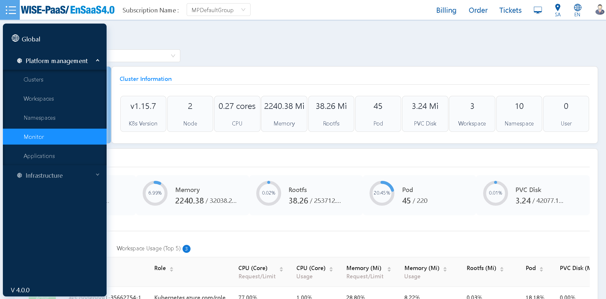
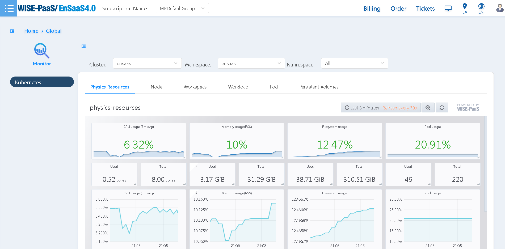
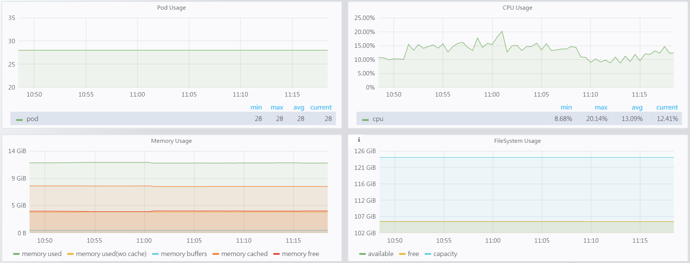
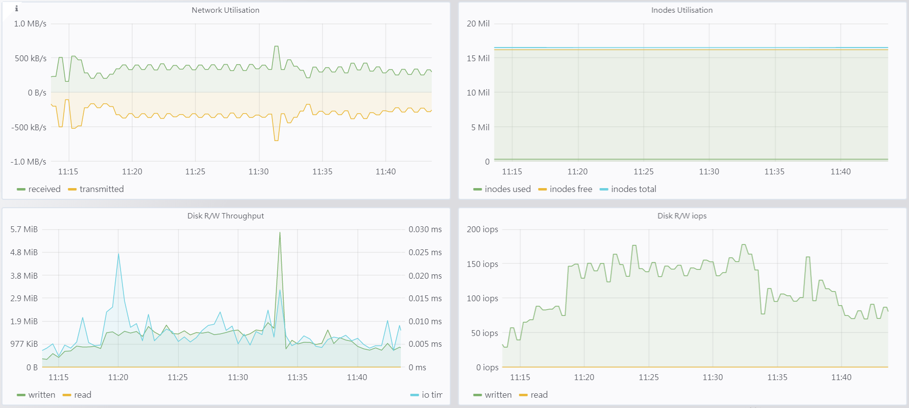
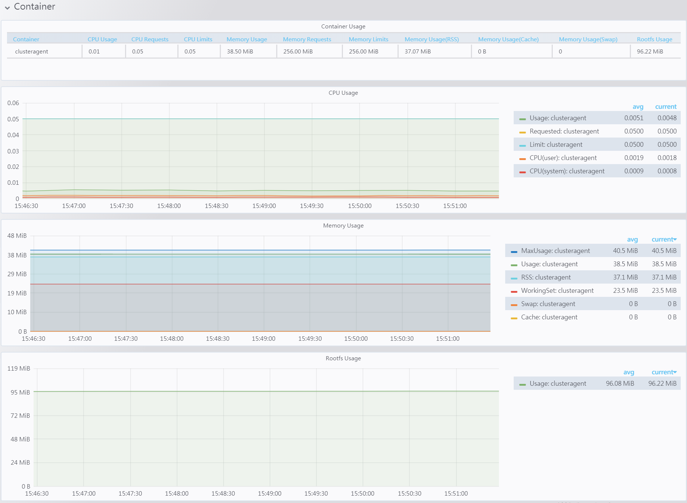

# 监控中心-RMS服务手册

## 什么是RMS

RMS（全称 RealTime Monitor Service）实时监控服务是一款基于prometheus的稳定，高效，灵活的监控告警系统，包含监控和告警服务，提供多维度的监控和告警，多层级涵盖了cluster（集群），node（节点），workspace（工作空间），namespace（命名空间），pod（容器组），workload（工作负载），container（容器）的层级，及多服务db，iothub，apim等服务的监控及报警，搭配Dashboard提供丰富的监控面板组成监控中心，能帮助您高效的进行运维管理。

## 如何查看监控面板

#### 前提条件

1. 已订阅dedicated cluster
2. 已订阅RMS服务（包括 RMS Lite版本和RMS Std版本）
3. 已有登录账号（包含clusterowner，workspaceowner或namespacedeveloper）

#### 查看监控面板

在菜单->Platform management->**Monitor**，进入监控中心，即可看到监控面板。

不同的权限看到的面板是不同的，下面列出不同权限可看到的面板

clusterowner权限：physics-resources -> node -> workspace -> pod ->workload -> persistent-volumes

workspaceowner权限： workspace -> pod ->workload -> persistent-volumes

namespacedeveloper权限：workspace -> pod ->workload -> persistent-volumes

如您具有clusterowner权限，您看到的面板列表是：

如您是workspaceowner和namespacedeveloper权限，您看到的面板列表是：

**监控面板页签说明：**

| 面板名称           | 面板说明                                                     |
| ------------------ | ------------------------------------------------------------ |
| physics-resources  | 显示集群的物理资源使用情况                                   |
| node               | 显示node节点的物理资源使用情况                               |
| workspace          | 显示按照workspace/namespace级别统计的监控指标                |
| pod                | 显示pod和container层级的资源使用情况，包括cpu，memory和network |
| workload           | 显示按照workload分类的监控指标，workload包括Deployment，StatefulSet，DaemonSet等 |
| persistent-volumes | 显示PV，PVC相关的资源使用情况                                |

以上是订购集群后默认可看到的面板，后续还可根据你订阅的其他服务（如DB，IoThub，APIM等），接入服务对应的面板。面板会持续更新，请以实际显示为准。

## 如何监控集群状态

在监控中心提供了集群的 CPU、内存、网络和磁盘等相关物理资源指标的监控，节点的 CPU、内存、网络和磁盘等相关物理资源指标的监控。除了提供集群和节点层级的监控数据，还提供了集群中各个层级的资源用量和变化趋势的汇总情况，包括工作空间（workspace），命名空间（Namespace），工作负载（workload）、容器组（pod）和容器（container）的资源使用情况。支持实时，历史回放及用量排行。

查看面板时，可以通过面板右上角的功能键，来切换选择时间范围，刷新等动作。

#### 查看集群资源使用情况
菜单点选physics-resources页，可以看到集群的物理资源使用情况。

首先显示的是集群的cpu，memory，rootfs，pod的使用率实时用量，以及资源的使用量和总量的实时值，帮助用户对目前集群的资源使用情况有个总体的了解。

接下来显示的资源用量的曲线图，第一排显示的是集群cpu，memory，rootfs，pod的使用率的曲线图，第二排显示的是网络用量（包括发送和接收的用量），硬盘Inode用量*（包括使用量和总量），硬盘IOPS用量（包括读和写每秒操作数），硬盘吞吐量（包括读和写的数据量）。

硬盘Inode用量*：每个文件都必须有一个 inode，用于储存文件的元信息，比如文件的创建者、创建日期，inode 也会消耗硬盘空间，大量的 cache 小文件也容易导致 inode 资源被使用耗尽。并且，有可能发生 inode 已经用光，但是硬盘还未存满的情况，此时就无法在硬盘上创建新文件。而 inode 的监控可以帮助用户知道集群 inode 的使用情况，防止因 inode 耗尽使得集群无法正常工作，提示用户及时清理临时文件。

最后，显示的是按Namespace统计的CPU和Memory使用量排名列表（Top5），可以帮助用户了解目前集群内那些命令空间的使用量较多，以便进一步的排查。

#### 查看节点资源使用情况

页签栏点选Node页，可以看到节点的物理资源使用情况。

首先，显示的是整体的node资源使用情况列表，依次为节点名称，容器组使用量，容器组使用率，CPU使用量，CPU使用率，memory使用量和memory使用率，硬盘使用量和硬盘使用率。列表可按任意一列进行升序，降序排列，点击列标题即可排序切换，可以帮助管理员快速发现潜在问题或定位某台节点资源不足的情况。

从下拉框选择想要查看的节点，在下方的曲线图中即可查看到选择节点的资源使用情况。

依次显示了该节点上容器组，CPU使用率，内存使用量，以及文件系统的使用量（即硬盘存储）。

*显示的最小值，最大值，平均值均对应的是选择的时间范围内的，当前值代表的是最新采集的指标值。

*内存分类项详见附录中指标项说明中的第2节。

接下来，显示的是节点CPU平均负载（包含1分钟，5分钟，15分钟，物理CPU核数），以及节点CPU每个内核的使用率。可帮助管理员根据CPU的使用情况快速准确的确认资源是否不足。

最后，依次显示的是网络使用情况（包含每秒接收与发送的数据量），硬盘Inode使用量趋势（含已使用，未使用和总量），磁盘读写吞吐量使用趋势图（读，写以及io的延迟时间），磁盘读写IOPS用量趋势（含每秒读和写的操作数）。

#### 查看工作空间和命名空间的资源使用情况

页签栏点选Workspace页，可以看到工作空间/命名空间（workspace/namespace）的资源使用情况。

从下拉框中选择需要查看的集群（cluster），工作空间（workspace）和命名空间（namespace），在面板中就可以看到对应的监控指标值。其中，namespace可选ALL（全部）或者单选某一个。

首先，显示的是选定工作空间workspace整体的资源使用情况，包括CPU，Memory和Network的资源用量情况。

第一行显示的是CPU，Memory和Network的资源用量的实时值（即采集到指标的最新值），第二行显示的是CPU，Memory和Network的资源用量的曲线趋势图，可以清晰的显示选定时间范围内的数值变化的趋势情况。

*Network网络用量实时值是发送（TX）和接收（RX）值的和，而趋势曲线图则分别显示了发送（TX）和接收（RX）。

接下来，显示的选定的workspace/namespace的资源使用情况列表，依次为命名空间（namespace）名称，命名空间中运行的容器组（pod）数，CPU用量，CPU Requests值，CPU Limits值，以及Memory(RSS)使用量，Memory Requests值和Memory Limits值。列表支持针对某一列指标进行排序，可升序和降序，点击列名即可进行排序和切换升序降序。此列表可清晰直观的看出该工作空间下命名空间使用的资源用量的对比情况，方便进一步排查资源占用的情况。

*CPU的单位均是Core，即核，如0.03 Core即30m，m为千分之一核。

最后，显示的是选定namespace下所有pod的资源使用情况，以列表形势呈现，支持排序和分页。使用该列表可以方便的排查，如在上面列表中看到某一个namespace用量很大，可在这个列表中进一步排查到底是那个pod使用过多。

*内存memory显示了usage和rss usage两种，关于两种内存的区别可详见附录中指标项说明中的第2节内存的分类。

#### 查看工作负载的资源使用情况

页签栏点选workload页，可以看到集群中工作负载（workload）的资源使用情况。

支持查看工作负载类型有deployment，statefulset，daemonset。从下拉框中选择需要查看的集群（cluster），工作空间（workspace）和命名空间（namespace），并选择想要查看的工作负载类型（workload_type）以及工作负载名称（workload），即可在面板中看到对应的监控指标值。

监控项包括实例运行时间，CPU，Memory，Network，以及工作负载的运行状态值，具体的指标含义详见附录中指标项说明中的第5节。根据工作负载的运行状态值可以直观的判断出当前该实例的健康状况，如Desired Replicas（期望副本数）为1而Available Replicas（可用副本数）为0，两个值不相等，即可判断有pod已经挂掉，运行状态不正常。

以列表形式显示工作负载的资源使用情况，依次显示时间，工作负载名称（Workload Name），工作负载类型（Workload Type）,运行中的容器组数（Running Pods），CPU使用量（CPU Usage），CPU Requests，CPU limits，内存使用量（Memory Usage），Memory Requests和Memory Limits。

图标显示工作负载的CPU使用量，内存使用量（RSS）和网络IO用量。

#### 查看容器组和容器的资源使用情况

页签栏点选Pod页，可以看到集群中容器组（pod）的资源使用情况。

从下拉框中选择需要查看的集群（cluster），工作空间（workspace）和命名空间（namespace），并选择想要查看的容器组（Pod）和容器（container），即可在面板中看到对应容器组的监控指标值。

监控项从容器组（pod）和容器（Container）两个层级分别显示。

首先，显示的是容器组的监控指标。

以列表显示容器组的资源使用情况，依次显示容器组名称（Pod），CPU使用量(CPU Usage)，CPU Requests，CPU Limits，内存使用量(Memory Usage)*,Memory Requests，Memory Limits，内存使用量（RSS），内存使用量（Cache），内存使用量（Swap）

*此内存使用量是总的内存用量

接下来，是以图表形式显示CPU使用量，内存使用量和网络IO用量，可直观看到用量的变化趋势。

下面是以列表显示的容器（container）的资源使用情况，监控的指标项与容器组（pod）的基本相同，增加了对文件系统用量（Rootfs）的监控。下方依次以图表显示CPU使用量（CPU Usage），内存使用量（Memory Usage）和文件系统存储用量（Rootfs Usage）。

其中，CPU使用量除了常规的显示cpu的使用量，request和limit外，还显示了cpu user和cpu system的用量。

文件系统存储用量（Rootfs Usage）可观察Container的ephemeral-storage用量。

#### 查看外挂磁盘的资源使用情况

页签栏点选Persistent Volumes页，可以看到容器使用的外挂磁盘（pvc）的资源使用情况。

从下拉框中选择需要查看的集群（cluster），工作空间（workspace）和命名空间（namespace），并选择想要查看的pvc，即可在面板中看到对应pvc的监控指标值。

首先显示的是该命名空间下外挂磁盘的一个整体使用情况，包括选定命名空间下挂载的外挂磁盘数（Volume Count by Namespace）。以列表形式显示外挂磁盘的信息，包含所在的命名空间名称，pvc的名称，容器组的名称，volume名称，已使用的容量（Used），剩余可用的容量（Available）和总容量（Capacity）。

下来显示的是volume的详细信息，包含已使用的容量（Used Space），剩余可用的容量（Available Space）和总容量（Capacity Space）。接下来显示的是当前容量的使用率，以及使用量和可用量的曲线趋势图；inode的使用率，以及inode的使用量和可用量的曲线趋势图。

Inode用量*：每个文件都必须有一个 inode，用于储存文件的元信息，比如文件的创建者、创建日期，inode 也会消耗硬盘空间，大量的 cache 小文件也容易导致 inode 资源被使用耗尽。并且，有可能发生 inode 已经用光，但是硬盘还未存满的情况，此时就无法在硬盘上创建新文件。而 inode 的监控可以帮助用户知道集群 inode 的使用情况，防止因 inode 耗尽使得集群无法正常工作，提示用户及时清理临时文件。

## 如何接收监控告警

目前支持微信和email接收告警，后续会增加更多的告警方式。

### 如何使用微信接收监控告警

微信接收监控告警是基于企业微信来发送的，需要您先加入我们的企业微信号。

若您已经订阅RMS服务，需要开通微信接收告警功能，可提工单给我们申请。

### 如何使用email接收监控告警

开通邮件接收告警功能，可通过工单系统给我们提工单进行申请。

## 附录

以下监控项和告警项会持续更新

###  监控项说明

1. physics-resources面板监控项说明

    | 监控项名称             | 监控项说明                                            |
    | ---------------------- | ----------------------------------------------------- |
    | CPU usage（5m avg）    | 集群CPU使用率（5分钟平均）                            |
    | Memory usage（RSS）    | 集群内存使用率，RSS 是常驻内存集（Resident Set Size） |
    | Filesystem usage       | 集群文件系统使用率                                    |
    | Pod usage              | 集群容器组使用率                                      |
    | Network Utilisation    | 集群网络用量                                          |
    | Disk Inode Utilisation | 集群磁盘Inode用量                                     |
    | Disk IOPS              | 集群磁盘IO操作数用量                                  |
    | Disk Throughput        | 集群磁盘每秒读/写数据量                               |

2. node面板监控项说明

    | 监控项名称          | 监控项说明                                           |
    | ------------------- | ---------------------------------------------------- |
    | Pod Usage           | 节点容器组用量                                       |
    | CPU Usage           | 节点CPU使用率                                        |
    | Memory Usage        | 节点内存使用率                                       |
    | FileSystem Usage    | 节点文件系统用量                                     |
    | System load         | 节点CPU平均负载（1分钟，5分钟，15分钟，物理CPU核数） |
    | Usage Per Core      | 节点每个CPU核的使用率                                |
    | Network Utilisation | 节点网络流量（包括上行和下行）                       |
    | Inodes Utilisation  | 节点磁盘Inodes用量                                   |
    | Disk R/W Throughput | 节点磁盘读/写数据量                                  |
    | Disk R/W iops       | 节点磁盘读/写操作数                                  |

    > 内存说明：
    >
    > 1. memory used：包括缓存
    > 2. memory used（wo cache）：不包括缓存（buffer，cache）
    > 3. memory buffers： 缓存
    > 4. memory cache： 缓存
    > 5. memory free： 剩余可用内存

    > CPU说明：
    > 平均负载：指单位时间内，单位 CPU 运行队列中处于可运行或不可中断状态的平均进程数。如果数值大于 1，表示 CPU 不足以服务进程，有进程在等待。

3. workspace面板监控项说明

    | 监控项名称      | 监控项说明                                              |
    | --------------- | ------------------------------------------------------- |
    | CPU Usage       | 工作空间CPU用量                                         |
    | Memory（RSS）   | 工作空间内存用量，RSS 是常驻内存集（Resident Set Size） |
    | Network         | 工作空间网络用量（包括上行和下行用量）                  |
    | CPU Requests    | 工作空间总的CPU Requests                                |
    | CPU Limits      | 工作空间总的CPU Limits                                  |
    | Memory Requests | 工作空间总的内存 Requests                               |
    | Memory Limits   | 工作空间总的内存 Limits                                 |

4. pod面板监控项说明
    | 监控项名称         | 监控项说明                       |
    | ------------------ | -------------------------------- |
    | CPU Usage          | 容器组CPU用量                    |
    | CPU Requests       | 容器组CPU Requests用量           |
    | CPU Limits         | 容器组CPU Limits用量             |
    | CPU (user)         | 容器组CPU (user)用量             |
    | CPU (system)       | 容器组CPU (system)用量           |
    | Memory Usage       | 容器组内存用量                   |
    | Memory Requests    | 容器组内存Requests用量           |
    | Memory Limits      | 容器组内存Limits用量             |
    | Memory MaxUsage    | 容器组内存最大使用量             |
    | Memory RSS         | 容器组常驻内存集使用量           |
    | Memory  WorkingSet | 容器组WorkingSet内存使用量       |
    | Memory Cache       | 容器组内存缓存使用量             |
    | Network I/O        | 容器组网络用量（包括上行和下行） |

5. workload面板监控项说明

    | 监控项名称          | 监控项说明                                               |
    | ------------------- | -------------------------------------------------------- |
    | CPU                 | 工作负载的CPU用量                                        |
    | Memory(RSS)         | RSS 是常驻内存集（Resident Set Size）                    |
    | Network             | 工作负载的网络用量（包括上行和下行流量）                 |
    | Desired Replicas    | 工作负载的期望副本数                                     |
    | Available Replicas  | 工作负载的可用副本数                                     |
    | Observed Generation | 最近观察到的工作负载可用的版本迭代（仅在镜像升级时更新） |
    | Metadata Generation | 工作负载的元配置数据被修改了多少次（包括配置文件和镜像） |
    | UpTime              | 实例运行时间                                             |

6. persistent-volumes面板监控项说明
    | 监控项名称             | 监控项说明               |
    | ---------------------- | ------------------------ |
    | Volume Used Space      | 外挂磁盘使用的磁盘用量   |
    | Volume Available Space | 外挂磁盘可用的磁盘用量   |
    | Volume Capacity Space  | 外挂磁盘的磁盘总的用量   |
    | Volume Space Usage     | 外挂磁盘的磁盘空间使用率 |
    | Volume inodes Usage    | 外挂磁盘inodes使用率     |

### 告警项说明

目前仅列出告警级别为critical的告警

| 告警项名称                         | 告警项级别 | 告警项说明                                                   |
| ---------------------------------- | ---------- | ------------------------------------------------------------ |
| Watchdog                           | none       | 告警系统的watchdog告警                                       |
| NodeDiskRunningFull                | critical   | node的filesystem可用空间即将用尽                             |
| AlertmanagerDown                   | critical   | AlertManager 从prometheus监控目标中消失                      |
| KubeAPIDown                        | critical   | APIServer从prometheus监控目标中消失                          |
| KubeStateMetricsDown               | critical   | KubeStateMetrics从prometheus监控目标中消失                   |
| KubeletDown                        | critical   | Kubelet从prometheus监控目标中消失                            |
| NodeExporterDown                   | critical   | NodeExporter从prometheus监控目标中消失                       |
| PrometheusOperatorDown             | critical   | PrometheusOperator从prometheus监控目标中消失                 |
| KubeDaemonSetRolloutStuck          | critical   | DaemonSet中有部分Pod部署失败                                 |
| KubeDeploymentGenerationMismatch   | critical   | Deployment部署失败，并且未回滚                               |
| KubeDeploymentReplicasMismatch     | critical   | Deployment 部署与预期的副本数量不匹配                        |
| KubePodCrashLooping                | critical   | Pod频繁重启                                                  |
| KubePodNotReady                    | critical   | Pod处于非就绪状态已超过一小时                                |
| KubeStatefulSetGenerationMismatch  | critical   | StatefulSet generation 不匹配，表明部署失败，并且未回滚      |
| KubeStatefulSetReplicasMismatch    | critical   | StatefulSet 实际副本与预期副本不一致，部署失败               |
| KubeStatefulSetUpdateNotRolledOut  | critical   | StatefulSet 更新状态未回滚                                   |
| KubePersistentVolumeErrors         | critical   | persistent volume 状态为Failed\|Pending                      |
| KubePersistentVolumeFullInFourDays | critical   | persistent volume使用空间将在4天内用尽（根据目前使用情况预测） |
| KubePersistentVolumeUsageCritical  | critical   | persistent volume可用空间小于3%                              |
| KubeAPIErrorsHigh                  | critical   | APIServer 错误码5xx的错误率过高                              |
| KubeAPILatencyHigh                 | critical   | APIServer 90% 延迟时间过高                                   |
| KubeClientCertificateExpiration    | critical   | APIServer的客户端证书将在不到24.0小时内到期                  |
| PrometheusErrorSendingAlerts       | critical   | prometheus发送告警时失败                                     |

