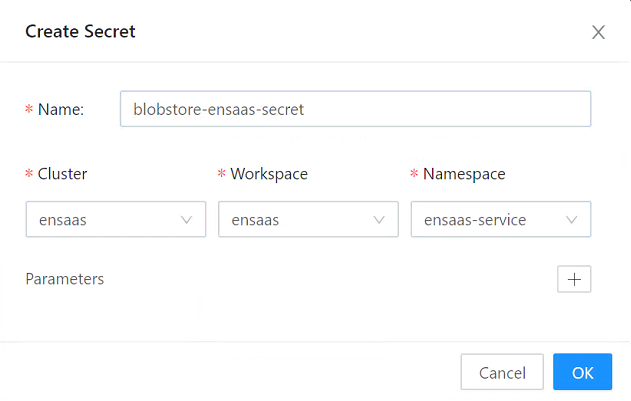
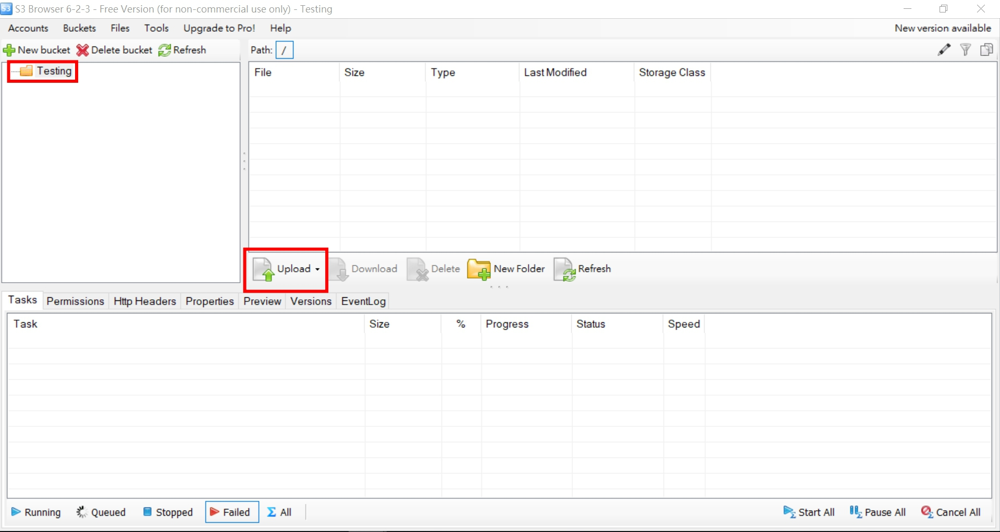

<!-- Document Revision History

2020.08.12

1. First version of this document.

-->

# WISE-PaaS BlobStore 服務簡介

WISE-PaaS/Blobstore提供統一的Amazon Simple Storage Service（簡稱S3 https://docs.aws.amazon.com/AmazonS3/latest/dev/Welcome.html ）標準接口，可以透過它來儲存資料，包含圖片，影片，音樂和文件等等。WISE-PaaS Private Cloud (WISE-Stack) 在OpenStack上提供了S3的接口（https://docs.openstack.org/mitaka/config-reference/object-storage/configure-s3.html ），可提供使用者儲存資料。BlobStore服務的使用場景，例如儲存OTA的更新包、儲存AI 模型，再透過OTA部署至本地端，或者也可將DB資料遷移至Blob中，以降低成本費用。

## BlobStore 連線方式：

使用者可使用第三方軟體 S3 Browser 來管理雲端物件儲存體的內容。

### Step 1: 下載 S3 Browser 6.2.3 版本

*目前只支援 S3 Browser 6.2.3 版本，其他版本不支援

連線至 https://s3-browser.en.uptodown.com/windows/download ，下載並安裝 S3 Browser。

### Step 2: 連線至 WISE-PaaS/EnSaaS Service Portal 建立 BlobStore 試用帳號

透過 SSO Portal登入帳號，再連線至 Service Portal 建立一組 BlobStore 試用帳號。操作步驟如下：

首先選擇 blobstore 的 Instance ，點擊「Action」後，再點擊「Secret Management」。

接著填入 Secret Name 以及選擇要建立 Secret 的 Namespace，再點擊「OK」。

Secret Name 建立成功後，點擊「Action」後，再點擊「View」查看連線資訊。

紀錄連線資訊 accessKey、endpoint 與 secretKey。

### Step 3: 透過 S3 Browser 連線至 Blobstore

安裝好後打開 S3 Browser，設定 Blobstore 連線資訊，其中Account Type 必須選擇「S3 Compatible Storage」，再依照 WISE-PaaS/EnSaaS Service Portal 建立的連線資訊，設定 REST Endpoint（61.219.26.12:8080）、Access Key ID 及 Secret Access Key 即可，而 Use secure transfer(SSL/TLS)選項請勿勾選。

連線資訊皆填入後，點擊下方「Advanced S3-compatible storage settings」，其中 Signature version 必須選擇「Signature V2」，接著點擊「Close」後，再點擊「Save changes」保存即可。

### Step 4: 透過 S3 Browser 連線至 Blobstore

連線成功後即可看到 Blobstore 儲存系統上的儲存體內容，只要透過 S3 Browser 就可以操作。在 S3 Browser 點擊「New Bucket」，接著在 Create New Bucket 視窗輸入 欲建立的儲存體名稱，再按下「Create new Bucket」即可。

### Step 5: 透過 S3 Browser 上傳或下載檔案

點選左側之儲存體（Bucket），即可上傳或下載檔案。

