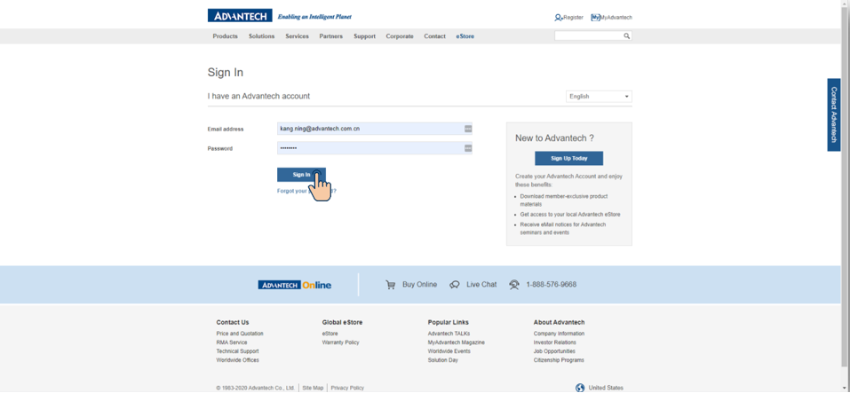
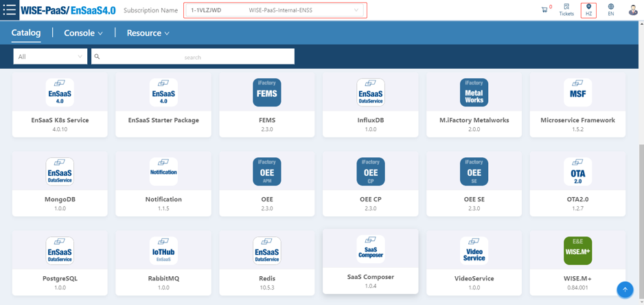
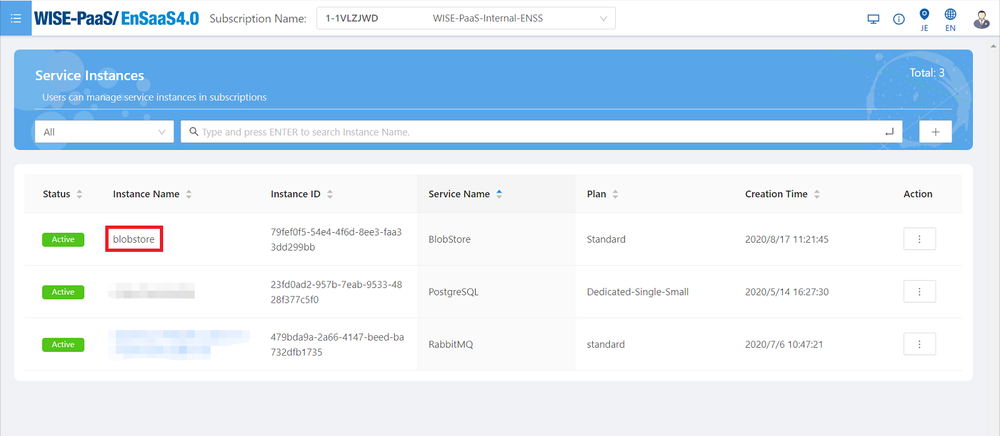
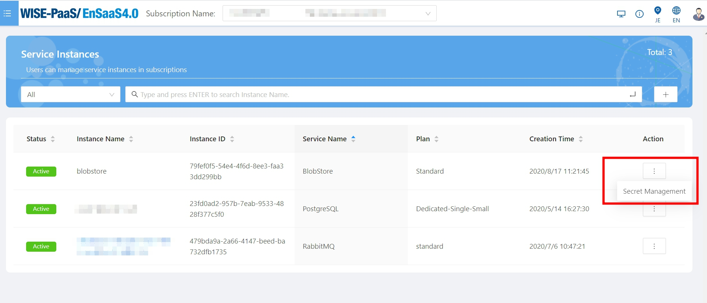
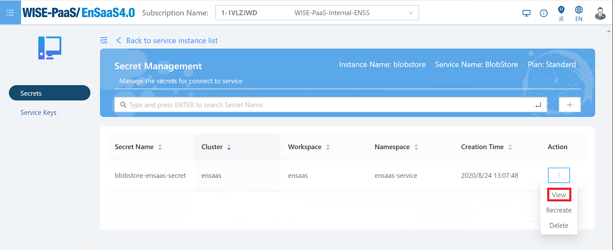
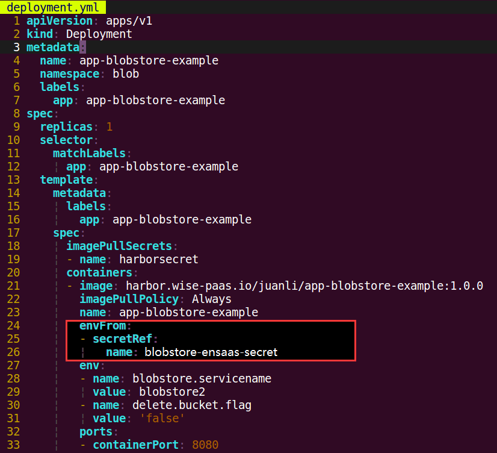
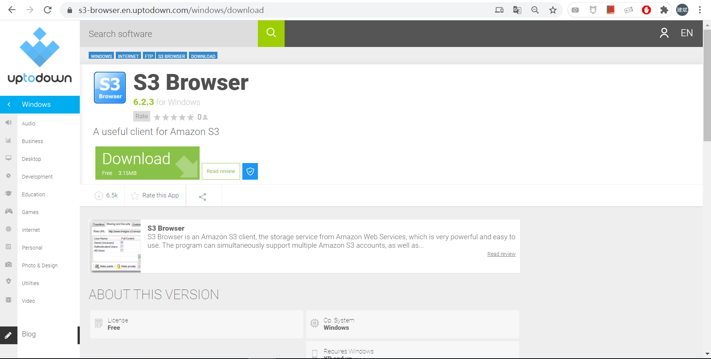
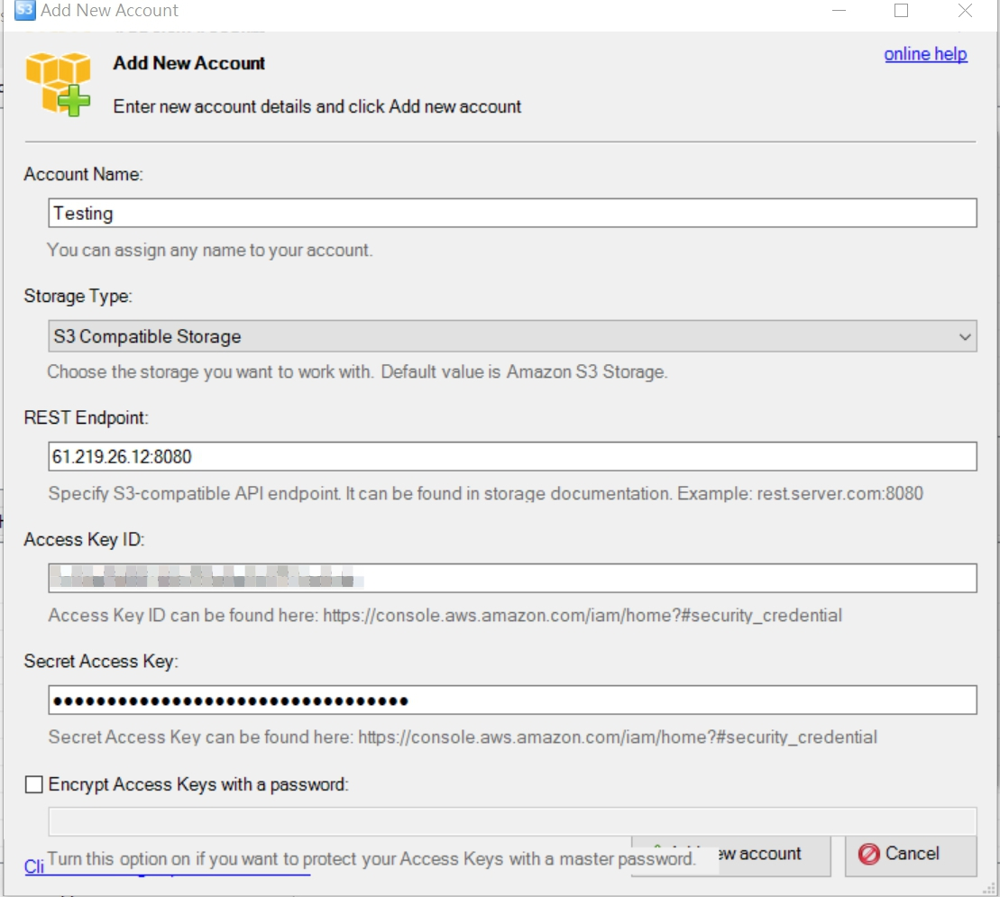
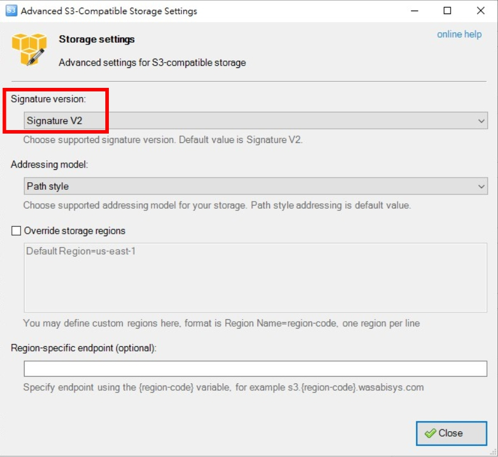

<!-- Document Revision History

2020.08.21

1. First version of this document.

-->


# WISE-PaaS/Blobstore服务

## 产品简介
WISE-PaaS/Blobstore是一种适用于云的低成本、安全可靠的对象存储解决方案，它最适合用来存储海量的非结构化数据，如图片，视频，音乐和文档等。WISE-PaaS/Blobstore支持多种云平台的存储服务，比如Azure的Blob，阿里云的OSS，以及Amazon的S3等，并在这些服务之上提供统一的Amazon Simple Storage Service（简称[S3](https://docs.aws.amazon.com/AmazonS3/latest/dev/Welcome.html)）标准接口以及便利的密钥管理方式，方便WISE-PaaS平台工业应用以一致接口快速整合。


## 主要特点

1.	支持多种云平台的存储服务

2. 提供统一的标准Amazon S3接口，所有针对S3操作的API和工具都可用

3.	提供数据持久化存储

4.	加密存储，访问权限管控，安全可靠

5.	支持EB级海量数据存储

6.	成本低

7.	支持移动设备上传下载图片，音频，视频文件等


## 快速入门

通常，从新购实例到可以开始使用实例，您需要完成如下操作。

1. [登录EnSaaS Catalog](#step1登录ensaas-catalog)
2. [创建Blobstore实例](#step2创建blobstore实例)
3. [创建Secret](#step3创建secret)
4. [查看Secret](#step4查看secret)
5. [在App中使用Secret连接Blobstore](#step5在app中使用secret连接blobstore)
6. [使用S3 Browser连接Blobstore](#step6使用s3-browser连接blobstore)

### Step1：登录EnSaaS Catalog

1. 登入 [EnSaaS Portal](https://portal-catalog-ensaas.sa.wise-paas.com/)，选择 EnSaaS 数据中心。

请根据您正式订阅 WISE-PaaS 云服务时的数据中心进行选择，推荐 Global 使用者选择 Azure Singapore 数据中心，中国区域使用者选择阿里云杭州数据中心，日本区域使用者选择 Japan East 数据中心。


2. 点击 「 MyAdvantech 」，以 MyAdvantech 账号登入 EnSaaS Portal。


3. 填入 MyAdvantech 帐密，以 MyAdvantech 账号登入。

首次以MyAdvantech账号登入 EnSaaS Portal，会弹出提示窗提示您同意将 MyAdvantech 账号与 EnSaaS/SSO账号绑定。若您尚未开通 EnSaaS/SSO 账号，在此过程中会自动为您创建 EnSaaS/SSO 账号，并将包含预设 SSO 帐密的注册信发送到您的信箱。在后续的登入中您可以根据需要选择直接使用 EnSaaS/SSO 帐密登入，或以 MyAdvantech 帐密登入。



4. 登入 EnSaaS Catalog，选择和确认订阅号。

如果您有多个 EnSaaS 4.0 订阅号，登入后提醒您先选择和确认要订阅云服务的订阅号。



### Step 2: 创建Blobstore实例

1. 选择要购买的Blobstore服务，按照提示订阅Blobstore服务。

2. 购买成功后，可以登录Service Portal查看购买的实例（目前仅有订阅号Admin和订阅号User可以查看），Service Portal可以从Catalog进入。

   
   
   

### Step 3: 创建Secret

成功订购Blobstore后，您可以通过Service 控制台（Service Portal）创建Secret，取得服务的连线信息。

说明：目前仅有订阅号Admin和订阅号User可以查看订阅的服务，并创建Secret。

1. 登入Service Portal之后，找到Blobstore服务实例，选择右方操作选项，进入Secret管理页面



2. 点击 "+" 按钮，弹出创建Secret的页面


3. 填写以下参数

    | 参数名称   | 说明                                                         |
    | ---------- | ------------------------------------------------------------ |
    | Name       | Secret的名称，WISE-PaaS平台的APP使用的Secret名称有一定规范，格式为：ServiceName-NamespaceName-secret |
    | Cluster    | 使用Secret的APP所在的集群，Secret创建后会注入到该集群下      |
    | Workspace  | 使用Secret的APP所在的Workspace，Secret创建后会注入到该Wokespace下 |
    | Namespace  | 使用Secret的APP所在的Namespace，Secret创建后会注入到该Namespace下 |
    | Parameters | 创建Secret时传入的参数|

4. 点击OK，创建成功。

### Step 4: 查看Secret
Secret创建好后，您可以选择View操作来查看Secret的信息。



记录连线信息 accessKey、endpoint和secretKey。


Secret是一组包含accessKey、endpoint和secretKey等信息的JSON格式文档，用来验证使用Blob对象的身份：
* endpoint: 连接blob的终端地址
* accessKey: Azure Blob Name，由小写字母和数字组成的介于 3 到 24 个字符之间的字符串
* secretKey:  Azure Blob Key，由随机数和字母组成的一组字符串
* type: s3-compatible

### Step 5: 在App中使用Secret连接Blobstore

用户可以将credential绑定在用户的APP中，假如生成的secret name为blobstore-ensaas-secret，将 APP deployment.yaml文件的spec->template->spec->envFrom->secretRef->name中填入secret的名字。示例方法如下：




#### 各种编程语言解析Credential

将服务实例绑定在APP中之后，从WISE-PaaS中的ENSAAS_SERVICES环境变量中检索凭据。以下是可用于获取ENSAAS_SERVICES的典型编程语言:

* <a class="false-class" href="#!./userguide.md#Java">Java</a>
* <a class="false-class" href="#!./userguide.md#Python">Python</a>
* <a class="false-class" href="#!./userguide.md#NodeJs">NodeJs</a>

#### Java

用户可以使用Java json库解析credential。下面是java中用Maven导入json库的例子：

```
<repositories>
    <dependency>
        <groupId>org.json</groupId>
        <artifactId>json</artifactId>
        <version>20180813</version>
    </dependency>
</repositories>

```

下面是APP Java解析BlobStore服务实例credential中endpoint, a accessKey and a secretKey的示例代码：

```
import org.json.JSONObject;

JSONObject ensaasServices = new JSONObject(System.getenv("ENSAAS_SERVICES"));

String endpoint = ensaasServices.getJSONArray("blobstore").getJSONObject(0).getJSONObject("credentials").getString("endpoint");
String accessKey = ensaasServices.getJSONArray("blobstore").getJSONObject(0).getJSONObject("credentials").getString("accessKey");
String secretKey = ensaasServices.getJSONArray("blobstore").getJSONObject(0).getJSONObject("credentials").getString("secretKey");
```

#### Python

下面是APP Python解析BlobStore服务实例credential中endpoint, a accessKey and a secretKey的示例代码：

```
import os
import json

#Load 'ENSAAS_SERVICES' from enviroment variable and parse the credentials of Blobstore service
ensaas_services = os.getenv('ENSAAS_SERVICES')
ensaas_services = json.loads(ensaas_services)
endpoint = ensaas_services['blobstore'][0]['credentials']['endpoint']
access_key = ensaas_services['blobstore'][0]['credentials']['accessKey']
secret_key = ensaas_services['blobstore'][0]['credentials']['secretKey']
```

#### NodeJs

下面是APP NodeJs解析BlobStore服务实例credential中endpoint, a accessKey and a secretKey的示例代码：

```
ensaas_services = process.env.ENSAAS_SERVICES
endpoint = ensaas_services['blobstore'][0].credentials.endpoint
access_key = ensaas_services['blobstore'][0].credentials.accessKey
secret_key = ensaas_services['blobstore'][0].credentials.secretKey
```

### Step 6: 使用S3 Browser连接Blobstore

用户可使用第三方软件 S3 Browser 来管理云端Blobstore存储的內容。
1. 下载 S3 Browser 6.2.3 版本

*目前只支援 S3 Browser 6.2.3 版本，其他版本不支援

连线至 https://s3-browser.en.uptodown.com/windows/download ，下载并安装 S3 Browser。



2. 获取Blobstore实例的连线信息，请参考Step 3和Step 4。

3. 透过S3 Browser 连线至 BlobStore

安裝好后打开 S3 Browser，设定 BlobStore 连线信息，其中Account Type 必须选择「S3 Compatible Storage」，再依照 WISE-PaaS/EnSaaS Service Portal 建立的连线信息，设定 REST Endpoint（61.219.26.12:8080）、Access Key ID 及 Secret Access Key 即可，而 Use secure transfer（SSL/TLS）选项请勿勾选。



连线信息都填入后，点击下方「Advanced S3-compatible storage settings」，其中 Signature version 必须选择「Signature V2」，接着点击「Close」后，再点击「Save changes」保存即可。




4. 创建bucket

连线成功后即可看到 BlobStore 存储系统上的存储体内容，只要透过 S3 Browser 就可以操作。在 S3 Browser 点击「New bucket」，接着在 Create New Bucket 视窗输入欲建立的存储体名称，再按下「Create new bucket」即可。


5. 上传或下载档案

点选左侧之储存体（Bucket），即可上传或下载档案。


