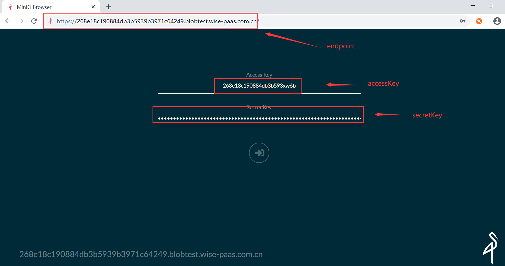
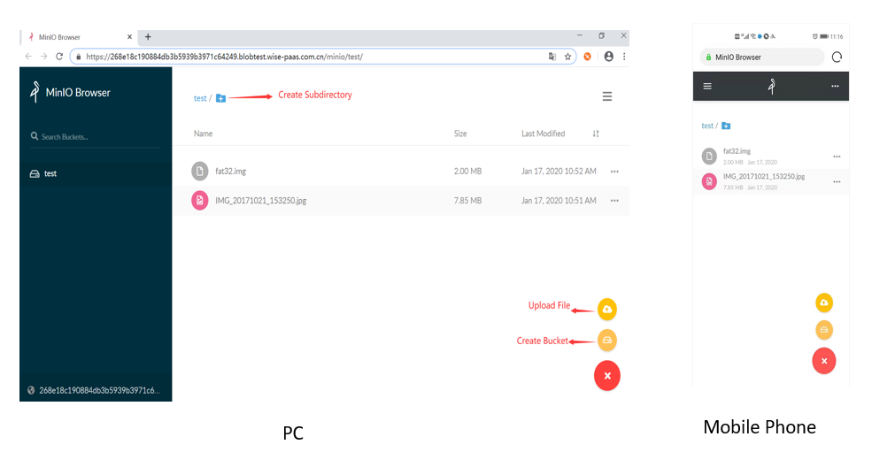
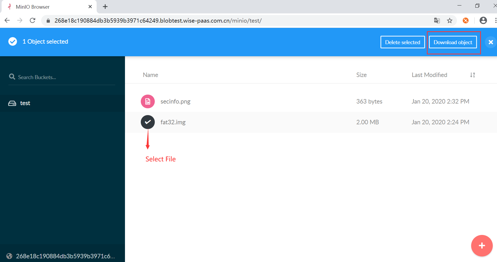
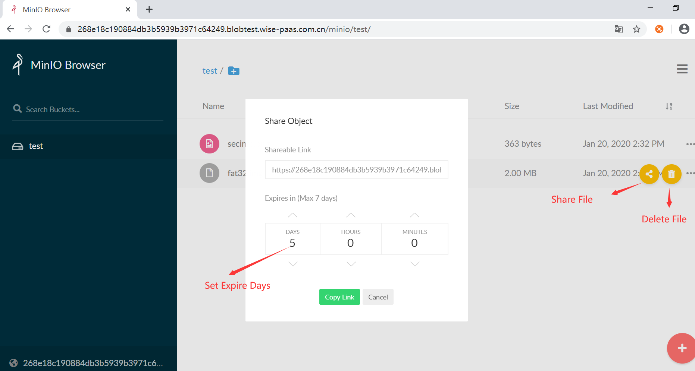

<!-- Document Revision History

2020.08.21

1. First version of this document.

-->


# WISE-PaaS Blobstore服务

## 产品简介
WISE-PaaS/Blobstore提供一种适用于云的对象存储解决方案。Blob存储最适合存储巨量的非结构化数据，非结构化数据是不遵循特定数据模型或定义的数据（如图片，视频，音乐和文档等）。WISE-PaaS/Blobstore提供统一的Amazon Simple Storage Service（简称S3）标准接口，保证WISE-PaaS公有云和私有云对SRP可以提供一致性接口。

## 主要特点

1. 提供标准Amazon S3接口，所有针对S3操作的API和工具都可用

2. 提供数据持久化存储

3. 支持SSL确保数据可靠传输

4. 数据有效隔离，各租户之间数据是相互隔离的，安全可靠

6. 支持移动设备上传下载图片，音频，视频文件等

7. 可查看实时用量，日用量，月用量等


## 快速入门

通常，从新购实例到可以开始使用实例，您需要完成如下操作。

1. 创建Blobstore实例
2. 创建Secret
3. 查看Secret
4. App使用Secret连接Blobstore
5. 使用S3 Browser连接Blobstore

### Step 1: 创建Blobstore实例

您可以通过WISE-PaaS云服务市场或者直接登录EnSaaS Catalog订阅Blobstore服务，订阅成功后就会创建Blobstore实例。

1. 登录EnSaaS Catalog，各个站点的Catalog地址如下，按照提示订阅Blobstore服务：

   | 站点代码 | 站点地点          | 站点链接                                          |
| -------- | ----------------- | ------------------------------------------------- |
   | SA       | Azure Singapore   | https://portal-catalog-ensaas.sa.wise-paas.com    |
| HZ       | Alibaba  Hangzhou | https://portal-catalog-ensaas.hz.wise-paas.com.cn |
   | JE       | Japan East        | https://portal-catalog-ensaas.jp.wise-paas.com    |

2. 订阅成功后，可以登录Service控制台（目前仅有订阅号Admin和订阅号User可以查看），查看购买的实例，Service控制台地址如下：

   | 站点代码 | 服务              | 站点地点          | 站点链接                                          |
| -------- | ----------------- | ----------------- | ------------------------------------------------- |
   | SA       | Management Portal | Azure Singapore   | https://portal-mp-ensaas.sa.wise-paas.com         |
| SA       | Service Portal    | Azure Singapore   | https://portal-service-ensaas.sa.wise-paas.com    |
   | HZ       | Management Portal | Alibaba  Hangzhou | https://portal-mp-ensaas.hz.wise-paas.com.cn      |
   | HZ       | Service Portal    | Alibaba  Hangzhou | https://portal-service-ensaas.hz.wise-paas.com.cn |
   | JE       | Management Portal | Japan East        | https://portal-mp-ensaas.jp.wise-paas.com         |
   | JE       | Service Portal    | Japan East        | https://portal-service-ensaas.jp.wise-paas.com    |

### Step 2: 创建Secret

透過 SSO Portal登入帳號，再連線至 Service Portal 建立一組 BlobStore 試用帳號。操作步驟如下：

首先選擇 BlobStore 的 Instance ，點擊「Action」後，再點擊「Secret Management」。


接著填入 Secret Name 以及選擇要建立 Secret 的 Namespace，再點擊「OK」。


Secret Name 建立成功後，點擊「Action」後，再點擊「View」查看連線資訊。


紀錄連線資訊 accessKey、endpoint 與 secretKey。


### Step 3: 查看Secret


* endpoint: 一组字符串组成的https地址，如 **https://<binding_id>.blob.wise-paas.com**
* accessKey: Azure Blob Name，由小写字母和数字组成的介于 3 到 24 个字符之间的字符串
* secretKey:  Azure Blob Key，有随机数和字母组成的一组字符串
* type: s3-compatible, azure或者是azurecn

### Step 4: 将服务实例绑定在用户APP中

-------------------------------------------------------------

租户可以将credential绑定在用户的APP中，假如生成的secret name为blobstore-instance_credenitals，将 APP deployment.yaml文件的spec->template->spec->envFrom->secretRef->name中填入secret的名字。示例方法如下：


## 使用Credential

-------------------------------------------------------------

将服务实例绑定在APP中之后，从WISE-PaaS中的ENSAAS_SERVICES环境变量中检索凭据。以下是可用于获取ENSAAS_SERVICES的典型编程语言:

## 各种编程语言解析Credential

---------------------------------------

* <a class="false-class" href="#!./userguide.md#Java">Java</a>
* <a class="false-class" href="#!./userguide.md#Python">Python</a>
* <a class="false-class" href="#!./userguide.md#NodeJs">NodeJs</a>

## Java

用户可以使用Java json库解析credential。下面是java中用Maven导入json库的例子：

```
<repositories>
    <dependency>
        <groupId>org.json</groupId>
        <artifactId>json</artifactId>
        <version>20180813</version>
    </dependency>
</repositories>

```

下面是APP Java解析BlobStore服务实例credential中endpoint, a accessKey and a secretKey的示例代码：

```
import org.json.JSONObject;

JSONObject ensaasServices = new JSONObject(System.getenv("ENSAAS_SERVICES"));

String endpoint = ensaasServices.getJSONArray("blobstore-develop").getJSONObject(0).getJSONObject("credentials").getString("endpoint");
String accessKey = ensaasServices.getJSONArray("blobstore-develop").getJSONObject(0).getJSONObject("credentials").getString("accessKey");
String secretKey = ensaasServices.getJSONArray("blobstore-develop").getJSONObject(0).getJSONObject("credentials").getString("secretKey");
```

---------------------------------------

## Python

下面是APP Python解析BlobStore服务实例credential中endpoint, a accessKey and a secretKey的示例代码：

```
import os
import json

#Load 'ENSAAS_SERVICES' from enviroment variable and parse the credentials of Blobstore service
ensaas_services = os.getenv('ENSAAS_SERVICES')
ensaas_services = json.loads(ensaas_services)
endpoint = ensaas_services['blobstore-develop'][0]['credentials']['endpoint']
access_key = ensaas_services['blobstore-develop'][0]['credentials']['accessKey']
secret_key = ensaas_services['blobstore-develop'][0]['credentials']['secretKey']
```

---------------------------------------

## NodeJs

下面是APP NodeJs解析BlobStore服务实例credential中endpoint, a accessKey and a secretKey的示例代码：

```
ensaas_services = process.env.ENSAAS_SERVICES
endpoint = ensaas_services['blobstore-develop'][0].credentials.endpoint
access_key = ensaas_services['blobstore-develop'][0].credentials.accessKey
secret_key = ensaas_services['blobstore-develop'][0].credentials.secretKey
```

## BlobStore Portal

### Step1: 登录BlobStore Portal



### Step2: 创建bucket，上传文件



###  Step3: 下载文件



### Step4: 分享文件


